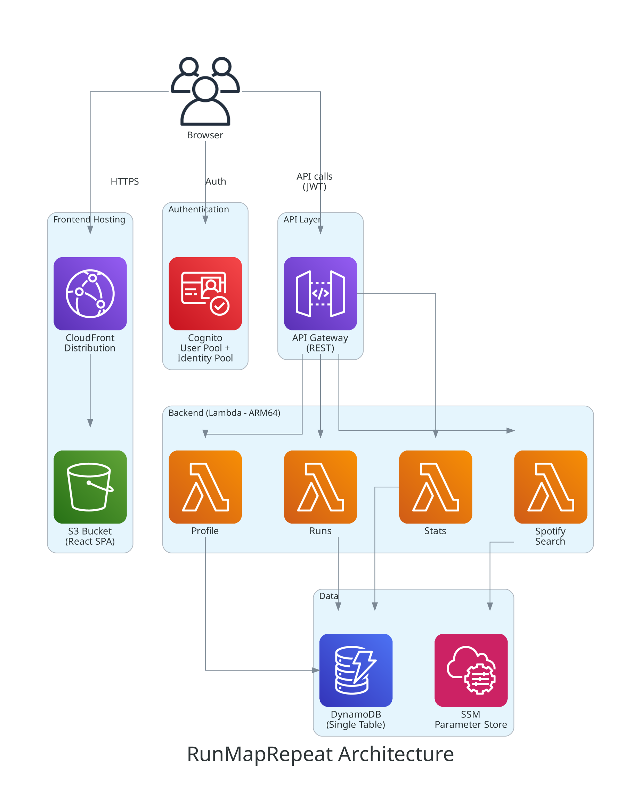
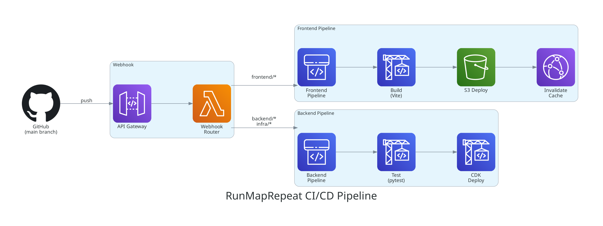

# 🏃 RunMapRepeat

A personal run tracking web app built with a fully serverless AWS architecture. Log runs, draw routes on an interactive map, track your stats, attach Spotify music, and plan future runs — all from a mobile-friendly interface.

## Use Case

**Problem:** Most run tracking apps are bloated, subscription-heavy, or lock your data in proprietary ecosystems.

**Solution:** RunMapRepeat is a lightweight, self-hosted alternative. You own your data, your infrastructure, and your deployment pipeline. It's designed for a single user (or small group) who wants full control over their running data without recurring SaaS costs.

### Who It's For

- Runners who want a clean, simple way to log and visualize their runs
- Developers interested in a real-world serverless full-stack reference architecture
- Anyone who wants to own their fitness data in their own AWS account

## Features

### 🗺️ Interactive Route Mapping
- Draw running routes on a map with click-to-add waypoints
- Automatic distance calculation from route geometry
- Location search powered by Amazon Location Service (Esri)
- Route visualization on run detail cards and dashboard

### 📊 Dashboard & Statistics
- **Stats cards** — current week/month distance, run count, pace, with week-over-week comparison
- **Weekly distance chart** — last 8 weeks bar chart
- **Monthly distance chart** — last 6 months visualization
- **Personal records** — longest run, fastest pace, best week
- **All-time totals** — total distance, runs, and time

### 🏃 Run Management
- Log completed runs with distance, duration, pace, elevation, and notes
- Plan future runs and mark them complete later
- Auto-calculated **pace** (min/km) and **calories burned** (based on profile weight)
- Edit and delete runs

### 🎵 Spotify Integration
- Search Spotify for artists, albums, or tracks
- Attach music to any run ("what I listened to")
- Links to Spotify with album art display

### 👤 User Profile
- Height, weight, display name, email
- Weight used for calorie calculations
- Email subscription preferences (weekly/monthly summaries)

### 🔐 Authentication
- Self-registration with email verification
- Cognito-backed auth with SRP flow
- Protected routes — every page requires login
- Profile setup gate for new users

## Architecture



**Key design decisions:**
- **Single-table DynamoDB** — all entities (profiles, runs) share one table with composite keys
- **ARM64 Lambdas** — Graviton-powered for better price-performance
- **Cognito dual pool** — User Pool for auth, Identity Pool for direct AWS service access (Location Service)
- **CloudFront SPA hosting** — S3 origin with 403/404 → index.html rewrites for client-side routing

### AI Code Review & Auto-Fix Pipeline

Every PR is automatically reviewed and fixed by AI agents:

```
PR push → Tests (Vitest/pytest/CDK) → AI Review (Opus 4.6) → Auto-Fix (Sonnet 4) → Re-review
```

| Agent | Model | What it does |
|-------|-------|--------------|
| **Review Agent** | Claude Opus 4.6 (Bedrock) | Reviews diffs for security, bugs, AWS best practices, test coverage. Posts inline comments with severity levels. Auto-resolves previously-fixed issues. |
| **Fix Agent** | Claude Sonnet 4 (Bedrock) | Reads review findings, fixes source code, runs tests, pushes. Reverts fixes that break tests. Max 2 cycles before escalating to human. |

- **Security enforced**: SLATS rules in `.claude/rules/security.md` auto-loaded by all agents
- **Zero human intervention** for review + fix cycle (uses GitHub App token to trigger cross-workflow)
- **Human approval required** for merge (bot never approves)
- **Disable per-PR**: add `no-auto-fix` label to skip auto-fix

See [AI Review & Fix Pipeline Design Doc](docs/design/ai-review-and-fix-pipeline.md) for full details.

### CI/CD Pipeline



**Path-based routing:** A GitHub webhook Lambda inspects changed files and triggers only the relevant pipeline:
- `frontend/`, `buildspec.yml` → Frontend Pipeline
- `backend/`, `infra/` → Backend Pipeline

### CDK Stacks

| Stack | Resources |
|-------|-----------|
| `RunMapRepeat-Auth` | Cognito User Pool, Identity Pool, IAM roles, SSM params |
| `RunMapRepeat-Frontend` | S3 bucket, CloudFront distribution (SPA hosting) |
| `RunMapRepeat-Data` | DynamoDB single-table (PAY_PER_REQUEST) |
| `RunMapRepeat-Api` | API Gateway, Lambda functions (profile, runs, stats, spotify), Location Service Place Index |
| `RunMapRepeat-Pipeline` | Frontend CI/CD (CodePipeline V2 + CodeBuild) |
| `RunMapRepeat-Backend-Pipeline` | Backend CI/CD (CodePipeline V2 + CodeBuild) |
| `RunMapRepeat-Webhook` | GitHub webhook receiver (API Gateway + Lambda) |

## Tech Stack

| Layer | Technology |
|-------|-----------|
| **Frontend** | React 18, TypeScript, Vite, MapLibre GL JS, Recharts |
| **Backend** | Python 3.12, AWS Lambda (ARM64/Graviton) |
| **Database** | DynamoDB (single-table design) |
| **Auth** | Amazon Cognito (User Pool + Identity Pool) |
| **Maps** | MapLibre GL JS + Amazon Location Service (Esri) |
| **Hosting** | S3 + CloudFront |
| **IaC** | AWS CDK (Python) |
| **CI/CD** | AWS CodePipeline V2 + CodeBuild (ARM64) |
| **Notifications** | Telegram Bot API (pipeline events + GitHub webhooks) |
| **Music** | Spotify Web API (search) |
| **AI Review** | Claude Opus 4.6 + Sonnet 4 via Amazon Bedrock (OIDC) |

## Project Structure

```
runmaprepeat/
├── .claude/                # Claude Code configuration
│   └── rules/              # Auto-loaded rules (security, backend, frontend, infra)
├── .github/
│   ├── workflows/
│   │   ├── pr-review.yml   # Tests → AI review → trigger fix
│   │   └── claude-fix.yml  # Auto-fix via claude-code-action
│   ├── scripts/
│   │   ├── ai_review.py    # Review agent (Opus 4.6 + Bedrock)
│   │   └── test_ai_review.py
│   └── prompts/
│       ├── review.md       # Review prompt template
│       └── fix.md          # Fix agent instructions
├── frontend/               # React SPA
│   ├── src/
│   │   ├── api/            # API client (Cognito-authed fetch)
│   │   ├── auth/           # AuthProvider, Login, Register, ProfileGate
│   │   ├── components/
│   │   │   ├── Dashboard/  # StatsCards, WeeklyDistanceChart, MonthlyDistanceChart
│   │   │   ├── Map/        # RunMap (draw routes), RouteMap (view), LocationSearch
│   │   │   ├── NavBar/     # BottomNav (mobile-first)
│   │   │   └── Spotify/    # SpotifySearch
│   │   ├── pages/          # Dashboard, NewRun, RunDetail, PlannedRuns, Profile
│   │   ├── types/          # TypeScript types (run, profile, stats, audio)
│   │   └── utils/          # distance calc, formatting, map helpers
│   ├── e2e/                # Playwright end-to-end tests
│   └── package.json
├── backend/                # Lambda handlers (Python)
│   ├── handlers/           # profile, runs, stats, spotify_search
│   ├── data/               # DynamoDB data access layer
│   └── tests/              # pytest unit + integration tests
├── infra/                  # AWS CDK (Python)
│   ├── app.py              # CDK app entry point
│   ├── stacks/             # 7 CDK stacks
│   └── tests/              # CDK stack tests
├── buildspec.yml           # Frontend CodeBuild spec
└── WORKFLOW.md             # Development workflow & agent roles
```

## API Endpoints

All endpoints require Cognito JWT authorization.

| Method | Path | Description |
|--------|------|-------------|
| `GET` | `/profile` | Get user profile |
| `PUT` | `/profile` | Create/update profile |
| `GET` | `/runs` | List all runs |
| `POST` | `/runs` | Create a run (planned or completed) |
| `GET` | `/runs/{runId}` | Get run details |
| `PUT` | `/runs/{runId}` | Update a run |
| `DELETE` | `/runs/{runId}` | Delete a run |
| `POST` | `/runs/{runId}/complete` | Mark planned run as completed |
| `GET` | `/stats` | Get aggregated statistics |
| `GET` | `/spotify/search?q=...&type=...` | Search Spotify catalog |

## DynamoDB Schema

Single-table design with composite key:

| Entity | PK (`userId`) | SK | Attributes |
|--------|--------------|-----|------------|
| Profile | `<cognito-sub>` | `PROFILE` | email, displayName, heightCm, weightKg, emailSubscriptions |
| Run | `<cognito-sub>` | `RUN#<ulid>` | status, runDate, title, route, distanceMeters, durationSeconds, paceSecondsPerKm, caloriesBurned, notes, audio |

## Development

### Prerequisites

- Node.js 22+
- Python 3.12+
- AWS CDK CLI (`npm install -g aws-cdk`)
- AWS CLI configured with appropriate permissions

### Frontend

```bash
cd frontend
npm install
npm run dev          # Local dev server
npm run test         # Vitest unit tests
npx playwright test  # E2E tests
```

### Backend

```bash
cd backend
pip install -r requirements.txt
pytest tests/ -v                    # Unit tests
pytest tests/ -v -m integration     # Integration tests (needs AWS creds)
```

### Infrastructure

```bash
cd infra
pip install -r requirements.txt
cdk diff                            # Preview changes
cdk deploy --all                    # Deploy all stacks
cdk deploy RunMapRepeat-Api         # Deploy single stack
```

## Deployment

Deployments are fully automated via CodePipeline:

1. **Push to `main`** → GitHub webhook fires
2. **Webhook Lambda** routes to the correct pipeline based on changed file paths
3. **Frontend Pipeline:** `npm install` → `vite build` → S3 sync → CloudFront invalidation
4. **Backend Pipeline:** `pytest` (unit + CDK tests) → `cdk deploy` (API + Data stacks)
5. **Telegram notification** on pipeline success/failure

### Manual Deployment

```bash
# Frontend
cd frontend && npm run build
aws s3 sync dist/ s3://<site-bucket>/ --delete
aws cloudfront create-invalidation --distribution-id <dist-id> --paths "/*"

# Backend
cd infra && cdk deploy RunMapRepeat-Api RunMapRepeat-Data
```

## License

Private project. All rights reserved.
