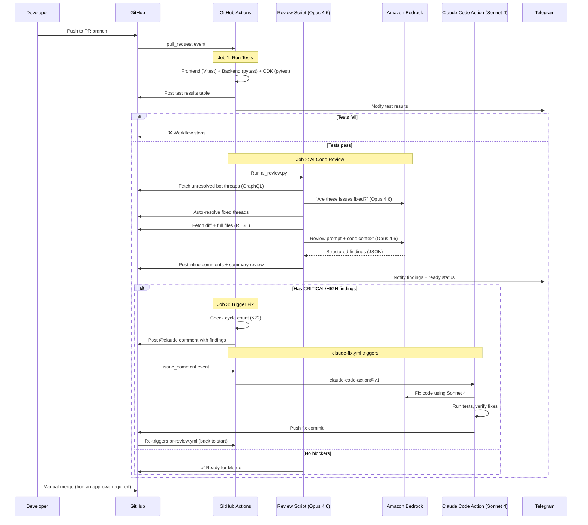

# Design Doc: Automated AI Code Review & Fix Pipeline

**Issue:** [#57](https://github.com/barakcaf/runmaprepeat/issues/57), [#73](https://github.com/barakcaf/runmaprepeat/issues/73)
**Author:** Loki (AI assistant)
**Date:** 2026-03-25
**Status:** Implemented

---

## Executive Summary

A fully automated code review and auto-fix pipeline for RunMapRepeat. Every PR gets reviewed by Claude Opus 4.6 (Amazon Bedrock), which posts inline comments and a merge signal. If the review finds blockers (CRITICAL/HIGH), a second agent — Claude Sonnet 4 via `claude-code-action` — automatically fixes the code, runs tests, and pushes. Up to 2 fix cycles run before escalating to a human.

Zero human intervention required for review + fix. Human approval still required for merge.

---

## 1. Architecture Overview

```
PR opened / push / reopened
         │
         ▼
┌─────────────────────────────────────────────────────────────┐
│  pr-review.yml                                              │
│                                                             │
│  Job 1: test           Run frontend/backend/CDK tests       │
│           │            Post results table + Telegram notify  │
│      Tests pass?                                            │
│       │       │                                             │
│      No      Yes                                            │
│       │       │                                             │
│    ❌ Stop    ▼                                             │
│  Job 2: review         AI review with Opus 4.6 (Bedrock)   │
│           │            Auto-resolve old fixed threads        │
│           │            Post inline comments + summary        │
│           │            Output: has_findings, findings_summary│
│           │                                                 │
│      Findings?                                              │
│       │       │                                             │
│      No      Yes                                            │
│       │       │                                             │
│  ✅ Ready     ▼                                             │
│  Job 3: trigger-fix    Check cycle count (max 2)            │
│                        Post @claude comment with findings    │
└─────────────────────────────────────────────────────────────┘
                         │
                         ▼ (issue_comment event)
┌─────────────────────────────────────────────────────────────┐
│  claude-fix.yml                                             │
│                                                             │
│  Job: fix              claude-code-action@v1                │
│                        - Sonnet 4 via Bedrock               │
│                        - Reads PR context + findings        │
│                        - Fixes code, runs tests, pushes     │
│                        - Auto-loads CLAUDE.md + .claude/rules│
└─────────────────────────────────────────────────────────────┘
                         │
                         ▼ (push triggers re-review)
                    Back to pr-review.yml
                    Old comments auto-resolved
                    Fresh review on new diff
                    Cycle repeats (max 2)
```

### Sequence Diagram



---

## 2. Components

### 2.1 Workflow Files

| File | Trigger | Purpose |
|------|---------|---------|
| `.github/workflows/pr-review.yml` | `pull_request` (open/sync/reopen) | Tests → Review → Trigger fix |
| `.github/workflows/claude-fix.yml` | `issue_comment` (created) | Runs `claude-code-action` on `@claude` comments |

### 2.2 Scripts & Prompts

| File | Purpose |
|------|---------|
| `.github/scripts/ai_review.py` | Review agent — fetches diff, calls Bedrock, posts review |
| `.github/scripts/test_ai_review.py` | Unit tests for the review script |
| `.github/prompts/review.md` | Review prompt — categories, severity levels, output format |
| `.github/prompts/fix.md` | Fix agent instructions — how to fix, test, and revert |

### 2.3 Claude Code Configuration (Auto-Loaded)

| File | Scope | What it provides |
|------|-------|------------------|
| `CLAUDE.md` | Always | Build commands, project layout, coding rules, gotchas |
| `.claude/rules/security.md` | All files (`**`) | AWS SLATS security rules — hard blockers |
| `.claude/rules/backend.md` | `backend/**` | Python/Lambda/DynamoDB conventions |
| `.claude/rules/frontend.md` | `frontend/**` | React/TypeScript conventions |
| `.claude/rules/infrastructure.md` | `infra/**` | CDK/CloudFormation rules |

These files are loaded by any Claude Code agent working in the repo — CI fix bot, local development, or manually spawned agents. The security rules use `globs: "**"` so they apply universally.

### 2.4 Authentication

```
GitHub Actions (OIDC provider)
    │
    ▼ (JWT token)
AWS IAM (trust policy: token.actions.githubusercontent.com)
    │
    ▼ (temporary credentials)
Amazon Bedrock (Converse API)
```

| Secret | Purpose |
|--------|---------|
| `AWS_OIDC_ROLE_ARN` | IAM role for Bedrock access (OIDC federated) |
| `APP_ID` | GitHub App ID for fix agent token generation |
| `APP_PRIVATE_KEY` | GitHub App private key |
| `TELEGRAM_BOT_TOKEN` | Telegram notifications (optional) |
| `TELEGRAM_CHAT_ID` | Telegram chat target (optional) |

No long-lived AWS credentials stored in GitHub. All Bedrock access uses short-lived OIDC tokens.

---

## 3. Review Agent (Opus 4.6)

### 3.1 What It Reviews

| # | Category | Focus |
|---|----------|-------|
| 1 | **Security** | Input validation, credential handling, CORS, XSS, IAM scope, injection |
| 2 | **Bugs & Error Handling** | Logic errors, missing try/catch, unhandled edge cases, wrong types |
| 3 | **AWS Best Practices** | Lambda config, IAM least-privilege, DynamoDB pagination, CDK patterns |
| 4 | **Code Quality** | Typing, DRY violations, dead code, unclear logic |
| 5 | **Test Coverage** | Missing tests for new/changed behavior, untested error paths |
| 6 | **Performance** | Unnecessary re-renders, redundant API calls, bundle size |
| 7 | **Data Integrity** | DynamoDB key schema violations, missing validation, decimal/float |

### 3.2 Severity Levels

| Level | Emoji | Meaning | Blocks Merge? |
|-------|-------|---------|---------------|
| CRITICAL | 🔴 | Security vulnerability or data loss | **Yes** — triggers auto-fix |
| HIGH | 🟠 | Bug or significant gap | **Yes** — triggers auto-fix |
| MEDIUM | 🟡 | Quality issue or minor bug | No |
| LOW | 🟢 | Improvement opportunity | No |

### 3.3 Feedback Loop

When new commits are pushed to a PR:

1. **Old comments checked** — fetches unresolved bot threads via GraphQL, asks Opus if each is fixed, auto-resolves fixed ones
2. **Fresh review** — reviews current diff, posts new inline comments
3. **Merge signal** — if zero unresolved CRITICAL/HIGH findings → "✅ Ready for Merge"

### 3.4 Guardrails

| Guardrail | Implementation |
|-----------|---------------|
| Tests gate review | `needs: test` — skipped if any test fails |
| Large PR bailout | Max 15 files / 1500 lines changed |
| No merge blocking | Posts `COMMENT` only — never `APPROVE` or `REQUEST_CHANGES` |
| Confidence threshold | 70% — don't flag speculative issues |
| Max 10 findings | Prioritized by severity |
| File filtering | Skips cdk.out/, node_modules/, images, lock files |
| Diff scope only | Don't flag pre-existing issues in unchanged code |

---

## 4. Fix Agent (Sonnet 4 via claude-code-action)

### 4.1 How It Works

1. Review agent posts an `@claude` comment with findings on the PR
2. `claude-fix.yml` triggers on `issue_comment` event
3. `anthropics/claude-code-action@v1` checks out the PR, reads the comment, and fixes the code
4. The action auto-loads `CLAUDE.md` and all `.claude/rules/` files
5. Fixes are tested (per instructions in `fix.md`), broken fixes are reverted
6. Working fixes are committed and pushed to the PR branch
7. Push triggers a re-review cycle

### 4.2 Safety Guards

| Guard | How |
|-------|-----|
| **Bot-only trigger** | `github.event.comment.user.login == 'github-actions[bot]'` — humans can't trigger |
| **PR-only** | `github.event.issue.pull_request` — ignores issue comments |
| **Cycle limit** | Max 2 fix cycles counted via comment history |
| **no-auto-fix label** | Skip fix if PR has `no-auto-fix` label |
| **Test verification** | Fix agent runs tests after each change, reverts if broken |
| **Security rules** | `.claude/rules/security.md` (SLATS) loaded automatically |
| **Scoped permissions** | GitHub App token (not default GITHUB_TOKEN) for fine-grained access |
| **Timeout** | 15-minute hard limit on fix agent execution |

### 4.3 Cycle Flow

```
Cycle 1: Review finds issues → @claude comment → fix agent pushes
Cycle 2: Re-review finds issues → @claude comment → fix agent pushes
Cycle 3: Review finds issues → "⚠️ Auto-Fix Limit Reached" → human review needed
```

---

## 5. GitHub API Usage

| API | Method | Used By | Purpose |
|-----|--------|---------|---------|
| `GET /repos/{repo}/pulls/{pr}` | REST | Review | PR metadata |
| `GET /repos/{repo}/pulls/{pr}/files` | REST | Review | Changed files + patches |
| `GET /repos/{repo}/contents/{path}` | REST | Review | Full file content |
| `POST /repos/{repo}/pulls/{pr}/reviews` | REST | Review | Post inline comments |
| `pullRequest.reviewThreads` | GraphQL | Review | Fetch unresolved threads |
| `resolveReviewThread` | GraphQL | Review | Auto-resolve fixed threads |
| `POST /repos/{repo}/issues/{pr}/comments` | REST | Trigger-fix | Post `@claude` comment |
| Push, comment, review | REST | Fix agent | Handled by `claude-code-action` |

---

## 6. Cost Estimate

For ~5-10 PRs/week, averaging 500 lines changed per PR:

| Component | Estimate |
|-----------|----------|
| Bedrock Opus 4.6 (review) | ~160K input + 60K output tokens/week |
| Bedrock Sonnet 4 (fix) | ~200K input + 100K output tokens/week (when fixes needed) |
| Monthly total | **~$20-35/month** |
| GitHub Actions | Free tier (2,000 min/month) |

---

## 7. What Was Tried and Why This Approach Was Chosen

### Approach 1: Claude Code CLI in GitHub Actions (Rejected)

**What we tried:** Install `@anthropic-ai/claude-code` via npm in the review workflow, pipe findings to the CLI with `--print --permission-mode bypassPermissions`, then commit and push from the same job.

**Problems:**
- **Shell injection risk** — findings text passed through shell variables could break commands or inject code
- **Brittle escaping** — multiline findings with quotes, backticks, and special characters required complex quoting that kept breaking
- **Heavy runner setup** — installing Node.js + npm + Claude Code CLI (~300MB) on every run added 2+ minutes
- **No PR context** — CLI only sees local files, doesn't understand the PR description, linked issues, or conversation history
- **Manual git workflow** — had to handle checkout, config, commit, push, and force-push logic ourselves
- **No comment interaction** — couldn't respond to the PR conversation or post status updates

**Why we moved away:** Too much glue code, too many failure modes, and the fix agent had no awareness of the PR context.

### Approach 2: Fix Agent in Same Workflow (Rejected)

**What we tried:** A third job in `pr-review.yml` that ran after review, installed Claude Code CLI, and fixed findings in-place.

**Problems:**
- All the same CLI problems from Approach 1
- **Cycle detection via commit messages** — checked `[ai-fix-cycle-N]` in the last commit message, which was fragile and broke on rebases
- **Tight coupling** — review and fix logic intertwined in one massive workflow file
- **No separation of concerns** — couldn't disable fixes without disabling review

### Approach 3: Comment-Triggered claude-code-action (Selected ✅)

**How it works:** Review posts an `@claude` comment → separate `claude-fix.yml` with `anthropics/claude-code-action@v1` picks it up.

**Why this won:**
- **Zero CLI installation** — `claude-code-action` handles everything (checkout, context, execution, push)
- **No shell injection** — findings are passed as a GitHub comment body, never through shell variables
- **Full PR context** — the action reads the PR description, linked issues, and full conversation history automatically
- **Clean separation** — review and fix are independent workflows, can be enabled/disabled separately
- **Cycle counting via comment history** — counts `@claude [ai-fix-cycle-N]` comments instead of commit messages, survives rebases
- **Battle-tested action** — maintained by Anthropic, handles edge cases we'd have to solve ourselves
- **Comment-based UX** — findings and fixes are visible in the PR conversation, creating a readable audit trail

### Approach 4: External SaaS (CodeRabbit, Copilot Review) — Not Chosen

**Why not:**
- Data leaves the repo to a third-party service
- Subscription cost for a personal project
- Less customizable review categories and severity levels
- Can't use Bedrock (requires Anthropic direct or their own infrastructure)
- No auto-fix capability integrated with the review flow

### Design Decision Summary

| Decision | Choice | Rationale |
|----------|--------|-----------|
| Review model | Opus 4.6 (Bedrock) | Best reasoning for complex code review |
| Fix model | Sonnet 4 (Bedrock) | Fast, capable, cost-effective for code changes |
| Fix mechanism | `claude-code-action` via comment trigger | Zero setup, full PR context, no shell risks |
| Auth | OIDC federation (GitHub → AWS) | No long-lived secrets |
| Cycle limit | 2 rounds | Prevents infinite loops, keeps costs predictable |
| Merge policy | Bot never approves | Human approval always required |
| Security enforcement | `.claude/rules/security.md` (SLATS) | Auto-loaded by all agents in the repo |

---

## 8. Risks and Mitigations

| Risk | Likelihood | Impact | Mitigation |
|------|-----------|--------|------------|
| False positive findings | Medium | Medium | 70% confidence threshold, max 10 findings, severity filtering |
| Fix introduces new bugs | Low | High | Tests run after every fix, broken fixes reverted |
| Fix agent modifies tests | Low | Medium | `fix.md` explicitly says "fix source code, NOT tests" |
| Auto-resolve incorrectly | Low | Medium | Conservative — only resolves when Opus is confident |
| Infinite review-fix loop | Low | Medium | Hard 2-cycle limit with escalation to human |
| Security rule bypass | Low | High | SLATS loaded as `globs: "**"` — can't be skipped |
| Cost overrun | Low | Low | ~$30/month typical, budget alerts on AWS account |
| Over-reliance on AI review | Low | High | Bot never approves — human merge required |

---

## 9. Files Reference

```
.github/
├── workflows/
│   ├── pr-review.yml          # Tests → Review → Trigger fix (3 jobs)
│   └── claude-fix.yml         # Fix agent (issue_comment trigger)
├── scripts/
│   ├── ai_review.py           # Review script (Bedrock Opus 4.6)
│   └── test_ai_review.py      # Review script unit tests
└── prompts/
    ├── review.md              # Review prompt (categories, format, rules)
    └── fix.md                 # Fix agent instructions

.claude/
└── rules/
    ├── security.md            # SLATS security rules (globs: **)
    ├── backend.md             # Python conventions (globs: backend/**)
    ├── frontend.md            # React/TS conventions (globs: frontend/**)
    └── infrastructure.md      # CDK conventions (globs: infra/**)

CLAUDE.md                      # Root config — build commands, project rules
```
