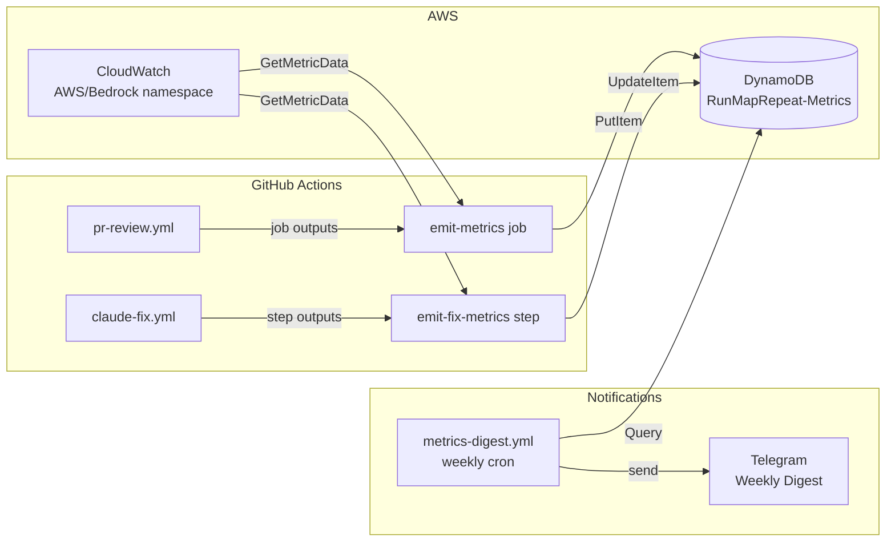

# Design Doc: PR and AI Review Metrics Tracking

**Issue:** [#209](https://github.com/barakcaf/runmaprepeat/issues/209)
**Author:** Principal Engineer (AI assistant)
**Date:** 2026-04-03
**Status:** Proposed

---

## Executive Summary

Add metrics tracking to the AI review and auto-fix pipeline so we can answer: *How much does each PR cost? How long do reviews take? How often does auto-fix succeed?*

Every workflow run records timing, token usage, findings count, and cost estimates in a dedicated DynamoDB table. A weekly Telegram digest surfaces trends. No new web dashboards — the existing notification infrastructure handles it.

Estimated cost for the metrics infrastructure itself: **$0/month** (all within free tier).

**Security Review:** Completed 2026-04-03 by security-engineer + principal-engineer. Two HIGH severity issues identified and remediated in this design. See Section 16 for full security assessment.

---

## 1. Architecture Overview

```
PR opened / push / reopened
         |
         v
+----------------------------------------------------------+
|  pr-review.yml                                            |
|                                                           |
|  Job 1: test          (existing)                          |
|    + Record per-suite durations via date commands          |
|    + Expose timing as job outputs                         |
|                                                           |
|  Job 2: review        (existing)                          |
|    + Record review start/end timestamps                   |
|    + Expose findings counts as job outputs                |
|    + Add [review-run:{run_id}] marker to trigger comment  |
|                                                           |
|  Job 3: trigger-fix   (existing, minor change)            |
|    + Embed review run_id in @claude comment               |
|                                                           |
|  NEW Job 4: emit-metrics                                  |
|    + Runs after jobs 1-3 (always, non-blocking)           |
|    + Fetches job timing via GitHub Actions API             |
|    + Queries CloudWatch for Bedrock token usage            |
|    + Calculates cost estimate                             |
|    + Writes DynamoDB record                               |
|    + Posts GitHub Actions job summary                     |
+----------------------------------------------------------+
         |
         v (if auto-fix triggered)
+----------------------------------------------------------+
|  claude-fix.yml                                           |
|                                                           |
|  Job: fix             (existing)                          |
|                                                           |
|  NEW step: emit-fix-metrics (always, at end of job)       |
|    + Records fix duration and outcome                     |
|    + Queries CloudWatch for fix profile token usage        |
|    + Updates parent review DynamoDB record                |
+----------------------------------------------------------+
         |
         v (weekly cron, Monday 9am UTC)
+----------------------------------------------------------+
|  NEW: metrics-digest.yml                                  |
|                                                           |
|  Job: digest                                              |
|    + Queries DynamoDB GSI for last 7 days                 |
|    + Computes aggregates (avg time, cost, success rate)   |
|    + Sends Telegram digest message                        |
+----------------------------------------------------------+
```

### Data Flow



---

## 2. Metrics Catalog

### Per-PR Review Metrics

| Metric | Type | Source | Collection Method |
|--------|------|--------|-------------------|
| `pr_number` | N | GitHub context | `github.event.pull_request.number` |
| `pr_title` | S | GitHub context | `github.event.pull_request.title` |
| `pr_author` | S | GitHub context | `github.event.pull_request.user.login` |
| `head_sha` | S | GitHub context | `github.event.pull_request.head.sha` |
| `files_changed` | N | GitHub context | `github.event.pull_request.changed_files` |
| `lines_changed` | N | GitHub context | `additions + deletions` |
| `run_id` | S | GitHub context | `github.run_id` |
| `test_total_ms` | N | GitHub API | Job `started_at` / `completed_at` |
| `test_frontend_ms` | N | Step timing | `date +%s%3N` before/after step |
| `test_backend_ms` | N | Step timing | Same |
| `test_cdk_ms` | N | Step timing | Same |
| `review_duration_ms` | N | GitHub API | Review job timing |
| `review_input_tokens` | N | CloudWatch | `AWS/Bedrock` `InputTokenCount` by inference profile |
| `review_output_tokens` | N | CloudWatch | `AWS/Bedrock` `OutputTokenCount` by inference profile |
| `findings_critical` | N | Review output | Parse from summary comment |
| `findings_high` | N | Review output | Parse from summary comment |
| `findings_medium` | N | Review output | Parse from summary comment |
| `findings_low` | N | Review output | Parse from summary comment |
| `review_verdict` | S | Review output | `clean` or `blocking` |
| `estimated_cost_usd` | N | Calculated | Tokens * per-token price |

### Per-Fix Cycle Metrics

| Metric | Type | Source |
|--------|------|--------|
| `fix_cycle` | N | Comment body `[ai-fix-cycle-N]` |
| `fix_duration_ms` | N | GitHub API job timing |
| `fix_input_tokens` | N | CloudWatch (fix inference profile) |
| `fix_output_tokens` | N | CloudWatch (fix inference profile) |
| `fix_outcome` | S | Step outcome (`success`/`failure`/`skipped`) |
| `fix_files_changed` | N | `git diff --stat` after fix |
| `fix_cost_usd` | N | Calculated |

### Aggregate Metrics (computed at query time in digest)

| Metric | Computation |
|--------|-------------|
| Average review duration | Mean of `review_duration_ms` over 7 days |
| Auto-fix success rate | `fix_outcome=success / total fix attempts` |
| Cost per merged PR | Sum of `estimated_cost_usd` / PR count |
| Findings distribution | Count by severity across all reviews |
| Fix cycle distribution | How many PRs need 0, 1, 2 fix cycles |
| Token usage trend | Week-over-week comparison |

---

## 3. DynamoDB Table Design

### Separate Metrics Table (Recommended)

**Table name:** `RunMapRepeat-Metrics`

The existing `RunMapRepeat-Table` uses `userId` as PK — CI metrics have no user context. A separate table avoids polluting the application data model and allows independent TTL and access patterns.

#### Schema

| Attribute | Type | Description |
|-----------|------|-------------|
| `PK` | S | `PR#<number>` |
| `SK` | S | `RUN#<run_id>` |
| `GSI1PK` | S | `METRICS` (constant — enables time-range queries) |
| `GSI1SK` | S | ISO 8601 timestamp |
| `type` | S | `review` (always — fix data is appended to the review record) |
| `timestamp` | S | ISO 8601 UTC |
| `ttl` | N | Unix epoch + 90 days |
| ...metrics | various | All fields from the catalog above |

#### Access Patterns

| Pattern | Key Condition | Used By |
|---------|---------------|---------|
| All runs for a PR | `PK = PR#123` | Drill into specific PR |
| Specific run | `PK = PR#123, SK = RUN#456` | Fix step UpdateItem |
| Recent reviews (time range) | `GSI1PK = METRICS, GSI1SK between X and Y` | Weekly digest |
| All reviews last 90 days | `GSI1PK = METRICS` | Trend analysis |

#### GSI1

| Attribute | Type | Value |
|-----------|------|-------|
| `GSI1PK` | S | `METRICS` |
| `GSI1SK` | S | ISO 8601 `timestamp` |

At ~10 PRs/week, the `METRICS` partition gets ~40-50 items/month. Hot partition is not a concern. If volume ever grew, shard by `METRICS#YYYY-MM`.

#### Sample Record

```json
{
  "PK": "PR#210",
  "SK": "RUN#12345678",
  "GSI1PK": "METRICS",
  "GSI1SK": "2026-04-03T14:30:00Z",
  "type": "review",
  "timestamp": "2026-04-03T14:30:00Z",
  "ttl": 1727964600,
  "pr_number": 210,
  "pr_author": "barakcaf",
  "pr_title": "feat: add route elevation profile",
  "head_sha": "abc123def",
  "files_changed": 8,
  "lines_changed": 245,
  "test_total_ms": 25700,
  "test_frontend_ms": 12400,
  "test_backend_ms": 8200,
  "test_cdk_ms": 5100,
  "review_duration_ms": 48000,
  "review_input_tokens": 32000,
  "review_output_tokens": 12000,
  "findings_critical": 0,
  "findings_high": 1,
  "findings_medium": 2,
  "findings_low": 1,
  "review_verdict": "blocking",
  "estimated_cost_usd": 1.38,
  "pricing_version": "2026-04",
  "fix_cycle": 1,
  "fix_duration_ms": 120000,
  "fix_input_tokens": 45000,
  "fix_output_tokens": 25000,
  "fix_outcome": "success",
  "fix_files_changed": 3,
  "fix_cost_usd": 0.51,
  "total_cost_usd": 1.89
}
```

#### Cost for Table

- ~50 writes/month, ~200 reads/month, < 1 KB per item
- **$0.00/month** — well within DynamoDB free tier (25 WCU/RCU, 25 GB)

---

## 4. Bedrock Token Tracking

### The Problem

The `claude-code-action` manages Bedrock API calls internally and does not expose token counts in its outputs. We need an external source for token usage.

### Option A: CloudWatch InvocationMetrics (Recommended)

Bedrock automatically publishes to CloudWatch when using inference profiles:

| Metric | Namespace | Dimension |
|--------|-----------|-----------|
| `InputTokenCount` | `AWS/Bedrock` | `ModelId` = inference profile ARN |
| `OutputTokenCount` | `AWS/Bedrock` | `ModelId` = inference profile ARN |
| `InvocationCount` | `AWS/Bedrock` | `ModelId` = inference profile ARN |
| `InvocationLatency` | `AWS/Bedrock` | `ModelId` = inference profile ARN |

**Collection approach:** After the review/fix step completes, query CloudWatch for the inference profile's metrics during the job's time window. The concurrency groups in both workflows (`pr-review-${{ pr_number }}` and `claude-fix-${{ pr_number }}`) ensure only one invocation per profile runs at a time, so the time window accurately isolates this run's tokens.

```bash
aws cloudwatch get-metric-data \
  --metric-data-queries '[{
    "Id": "inputTokens",
    "MetricStat": {
      "Metric": {
        "Namespace": "AWS/Bedrock",
        "MetricName": "InputTokenCount",
        "Dimensions": [{
          "Name": "ModelId",
          "Value": "arn:aws:bedrock:us-east-1:579083551251:application-inference-profile/x2ntqs4tet2b"
        }]
      },
      "Period": 3600,
      "Stat": "Sum"
    }
  }]' \
  --start-time "$REVIEW_JOB_START" \
  --end-time "$REVIEW_JOB_END"
```

**Profiles:**
- Review: `x2ntqs4tet2b` (Opus 4.6)
- Fix: `jk8gcjrpuokf` (Sonnet 4)

**Delay handling:** CloudWatch metrics have 1-3 minute propagation delay. The `emit-metrics` job runs after review completes, which already adds several minutes of natural delay (job scheduling, OIDC auth). If metrics are still unavailable, write `-1` as a sentinel and backfill in the weekly digest.

### Option B: CloudTrail Data Events (Not Recommended for Phase 1)

Per-invocation token counts via CloudTrail `InvokeModel` events. Exact but expensive ($0.10/100K events), 5-15 minute delay, requires Athena for querying.

### Option C: Parse claude-code-action Logs (Fragile)

The action may log token usage. Undocumented, could break on updates.

### Recommendation

**Option A** — zero code changes, free, reliable at our scale. Revisit Option B only if we need per-request granularity.

### Cost Calculation

```
review_cost = (input_tokens / 1_000_000 * 15) + (output_tokens / 1_000_000 * 75)  # Opus 4.6
fix_cost    = (input_tokens / 1_000_000 * 3)  + (output_tokens / 1_000_000 * 15)   # Sonnet 4
```

Store raw token counts in DynamoDB. Compute cost at read time so pricing changes don't require backfills.

---

## 5. GitHub Actions Timing

### Job-Level Timing (Primary)

The GitHub Actions REST API provides precise timing:

```
GET /repos/{owner}/{repo}/actions/runs/{run_id}/jobs
```

Returns `started_at` and `completed_at` for each job and step. The `emit-metrics` job calls this API to get timing for the test and review jobs that ran before it.

```javascript
const { data: jobs } = await github.rest.actions.listJobsForWorkflowRun({
  owner: context.repo.owner,
  repo: context.repo.repo,
  run_id: context.runId,
});

const testJob = jobs.jobs.find(j => j.name === 'Run Tests');
const reviewJob = jobs.jobs.find(j => j.name === 'AI Code Review');

const durationMs = (job) => job
  ? new Date(job.completed_at) - new Date(job.started_at)
  : 0;
```

### Step-Level Timing (For Individual Test Suites)

For per-suite timing (frontend, backend, CDK), add `date +%s%3N` commands before and after each test step and expose as job outputs:

```yaml
- name: Record frontend test start
  run: echo "FRONTEND_START=$(date +%s%3N)" >> $GITHUB_ENV

- name: Run frontend tests
  # ... existing step ...

- name: Record frontend test end
  run: echo "FRONTEND_DURATION=$(($(date +%s%3N) - FRONTEND_START))" >> $GITHUB_OUTPUT
```

### Cross-Workflow Correlation

The fix workflow is separate from the review workflow. To link them:

1. Add `[review-run:{run_id}]` marker to the `@claude` trigger comment
2. The fix `emit-fix-metrics` step parses this marker to find the parent review record
3. Uses `UpdateItem` to append fix metrics to the review's DynamoDB row

---

## 6. Dashboard: Weekly Telegram Digest

Rather than building a CloudWatch dashboard ($3/month) or a web UI, leverage the existing Telegram notification infrastructure:

### Weekly Digest Format

```
📊 Weekly AI Review Metrics (Mar 27 - Apr 3)

PRs Reviewed: 7
Total Review Runs: 9 (incl. re-reviews after fixes)
Fix Cycles: 4 (3 success, 1 failure)

⏱ Timing
  Avg test suite:     28s
  Avg AI review:      52s
  Avg fix cycle:      2m 15s
  Avg total pipeline: 4m 30s

💰 Cost
  Review tokens:  245K in / 89K out
  Fix tokens:     180K in / 95K out
  Total cost:     $18.40
  Cost per PR:    $2.63

🔍 Findings
  CRITICAL: 1  HIGH: 5  MEDIUM: 12  LOW: 8
  Auto-fix success rate: 75% (3/4)

📈 vs Last Week
  Review time:   ↓12%
  Cost:          ↑8%
  Fix success:   →stable
```

### Why Not CloudWatch Dashboard?

- $3/month for a dashboard that gets checked weekly is overengineered
- Telegram digest is actively pushed — zero effort to check
- DynamoDB data can be queried ad hoc via CLI when deeper analysis is needed
- Can always add a dashboard later if the data proves valuable

---

## 7. Sample Workflow Changes

### 7.1 pr-review.yml — New `emit-metrics` Job

**Implementation Note:** The `actions/github-script@v7` action does NOT include the AWS SDK by default. You must either:
1. Use a custom action that bundles the AWS SDK, OR
2. Install the AWS SDK in a prior step (e.g., `npm install @aws-sdk/client-dynamodb @aws-sdk/client-cloudwatch`), OR
3. Use a dedicated Lambda function or AWS CLI instead of inline JavaScript

The sample below assumes option #2 (install step added).

```yaml
emit-metrics:
  name: Emit Review Metrics
  needs: [test, review, trigger-fix]
  if: always() && needs.review.result != 'cancelled'
  runs-on: ubuntu-latest
  continue-on-error: true  # Metrics never block CI
  steps:
    - name: Configure AWS credentials (OIDC)
      uses: aws-actions/configure-aws-credentials@v4
      with:
        role-to-assume: ${{ secrets.AWS_OIDC_ROLE_ARN }}
        aws-region: us-east-1

    - name: Install AWS SDK for metrics collection
      run: npm install @aws-sdk/client-dynamodb @aws-sdk/client-cloudwatch

    - name: Collect and emit metrics
      uses: actions/github-script@v7
      with:
        script: |
          const { DynamoDBClient, PutItemCommand } = require('@aws-sdk/client-dynamodb');
          const { CloudWatchClient, GetMetricDataCommand } = require('@aws-sdk/client-cloudwatch');
          const ddb = new DynamoDBClient({ region: 'us-east-1' });
          const cw = new CloudWatchClient({ region: 'us-east-1' });

          // 1. Fetch job timing via GitHub API
          const { data: jobs } = await github.rest.actions.listJobsForWorkflowRun({
            owner: context.repo.owner,
            repo: context.repo.repo,
            run_id: context.runId,
          });
          const ms = (job) => job && job.completed_at
            ? new Date(job.completed_at) - new Date(job.started_at)
            : 0;
          const testJob = jobs.jobs.find(j => j.name === 'Run Tests');
          const reviewJob = jobs.jobs.find(j => j.name === 'AI Code Review');

          // 2. Query CloudWatch for Bedrock token usage
          const reviewProfileArn = 'arn:aws:bedrock:us-east-1:579083551251:application-inference-profile/x2ntqs4tet2b';
          const reviewStart = new Date(reviewJob?.started_at || Date.now());
          const reviewEnd = new Date(reviewJob?.completed_at || Date.now());
          // Expand window by 5 min each side to account for CloudWatch delay
          reviewStart.setMinutes(reviewStart.getMinutes() - 5);
          reviewEnd.setMinutes(reviewEnd.getMinutes() + 5);

          let inputTokens = -1, outputTokens = -1;
          try {
            const resp = await cw.send(new GetMetricDataCommand({
              MetricDataQueries: [
                { Id: 'input', MetricStat: { Metric: { Namespace: 'AWS/Bedrock', MetricName: 'InputTokenCount', Dimensions: [{ Name: 'ModelId', Value: reviewProfileArn }] }, Period: 3600, Stat: 'Sum' } },
                { Id: 'output', MetricStat: { Metric: { Namespace: 'AWS/Bedrock', MetricName: 'OutputTokenCount', Dimensions: [{ Name: 'ModelId', Value: reviewProfileArn }] }, Period: 3600, Stat: 'Sum' } },
              ],
              StartTime: reviewStart,
              EndTime: reviewEnd,
            }));
            inputTokens = resp.MetricDataResults?.[0]?.Values?.[0] ?? -1;
            outputTokens = resp.MetricDataResults?.[1]?.Values?.[0] ?? -1;
          } catch (e) {
            console.log('CloudWatch query failed:', e.message);
          }

          // 3. Calculate cost
          const reviewCost = inputTokens > 0
            ? (inputTokens / 1e6 * 15) + (outputTokens / 1e6 * 75)
            : -1;

          // 4. Write to DynamoDB
          const pr = context.payload.pull_request;
          const hasFindings = '${{ needs.review.outputs.has_findings }}';
          await ddb.send(new PutItemCommand({
            TableName: 'RunMapRepeat-Metrics',
            Item: {
              PK: { S: `PR#${pr.number}` },
              SK: { S: `RUN#${context.runId}` },
              GSI1PK: { S: 'METRICS' },
              GSI1SK: { S: new Date().toISOString() },
              timestamp: { S: new Date().toISOString() },
              pr_number: { N: String(pr.number) },
              pr_author: { S: pr.user.login },
              pr_title: { S: pr.title.substring(0, 200) },
              files_changed: { N: String(pr.changed_files || 0) },
              lines_changed: { N: String((pr.additions || 0) + (pr.deletions || 0)) },
              test_total_ms: { N: String(ms(testJob)) },
              review_duration_ms: { N: String(ms(reviewJob)) },
              review_input_tokens: { N: String(inputTokens) },
              review_output_tokens: { N: String(outputTokens) },
              review_verdict: { S: hasFindings === 'true' ? 'blocking' : 'clean' },
              estimated_cost_usd: { N: String(Math.round(reviewCost * 100) / 100) },
              ttl: { N: String(Math.floor(Date.now() / 1000) + 90 * 86400) },
            },
          }));
          console.log(`✅ Metrics emitted for PR #${pr.number}, run ${context.runId}`);
```

### 7.2 claude-fix.yml — New `emit-fix-metrics` Step

```yaml
- name: Emit fix metrics
  if: always()
  uses: actions/github-script@v7
  with:
    script: |
      const { DynamoDBClient, UpdateItemCommand } = require('@aws-sdk/client-dynamodb');
      const ddb = new DynamoDBClient({ region: 'us-east-1' });

      const prNumber = context.payload.issue.number;
      const commentBody = context.payload.comment.body || '';
      const cycleMatch = commentBody.match(/\[ai-fix-cycle-(\d+)\]/);
      const cycle = cycleMatch ? parseInt(cycleMatch[1]) : 1;
      const runMatch = commentBody.match(/\[review-run:(\d+)\]/);
      const reviewRunId = runMatch ? runMatch[1] : 'unknown';
      const fixOutcome = '${{ steps.claude-fix.outcome }}';

      // Fetch fix job timing
      const { data: jobs } = await github.rest.actions.listJobsForWorkflowRun({
        owner: context.repo.owner,
        repo: context.repo.repo,
        run_id: context.runId,
      });
      const fixJob = jobs.jobs.find(j => j.name === 'Claude Code Fix');
      const fixDurationMs = fixJob && fixJob.completed_at
        ? new Date(fixJob.completed_at) - new Date(fixJob.started_at)
        : 0;

      // Update the review's DynamoDB record
      await ddb.send(new UpdateItemCommand({
        TableName: 'RunMapRepeat-Metrics',
        Key: {
          PK: { S: `PR#${prNumber}` },
          SK: { S: `RUN#${reviewRunId}` },
        },
        UpdateExpression: 'SET fix_cycle = :c, fix_duration_ms = :d, fix_outcome = :o',
        ExpressionAttributeValues: {
          ':c': { N: String(cycle) },
          ':d': { N: String(fixDurationMs) },
          ':o': { S: fixOutcome },
        },
      }));
      console.log(`✅ Fix metrics emitted for PR #${prNumber}, cycle ${cycle}`);
```

### 7.3 Trigger Comment Change

Add `[review-run:{run_id}]` to the `@claude` comment in `pr-review.yml`:

```javascript
// In trigger-fix job, "Post @claude fix comment" step:
const body = [
  `@claude [ai-fix-cycle-${cycle}] [review-run:${{ github.run_id }}] You are the principal-engineer...`,
  // ... rest of comment unchanged
].join('\n');
```

---

## 8. IAM Permissions

Additional permissions needed on the existing OIDC role:

### DynamoDB Access (Scoped to Metrics Table)

```json
{
  "Effect": "Allow",
  "Action": [
    "dynamodb:PutItem",
    "dynamodb:UpdateItem",
    "dynamodb:Query"
  ],
  "Resource": [
    "arn:aws:dynamodb:us-east-1:*:table/RunMapRepeat-Metrics",
    "arn:aws:dynamodb:us-east-1:*:table/RunMapRepeat-Metrics/index/GSI1"
  ]
}
```

### CloudWatch Metrics Access (Read-Only, Namespace-Scoped)

```json
{
  "Effect": "Allow",
  "Action": "cloudwatch:GetMetricData",
  "Resource": "*",
  "Condition": {
    "StringEquals": {
      "cloudwatch:namespace": "AWS/Bedrock"
    }
  }
}
```

**Security Note:** While `cloudwatch:GetMetricData` does not support resource-level ARN restrictions, we apply a condition to limit queries to the `AWS/Bedrock` namespace only. This prevents the role from reading arbitrary CloudWatch metrics and limits blast radius if the role is compromised.

### OIDC Trust Policy (Tightened)

The existing trust policy should restrict branch access. Recommended trust policy `Condition`:

```json
{
  "StringLike": {
    "token.actions.githubusercontent.com:sub": [
      "repo:barakcaf/runmaprepeat:ref:refs/heads/main",
      "repo:barakcaf/runmaprepeat:pull_request"
    ]
  }
}
```

This allows metrics collection from main branch deploys and PR workflows, but blocks arbitrary branches from assuming the role.

---

## 9. CDK Changes

New table in a `MetricsStack` (or extend `DataStack`):

```python
# infra/stacks/metrics_stack.py
from aws_cdk import (
    RemovalPolicy,
    Stack,
    aws_dynamodb as dynamodb,
)
from constructs import Construct


class MetricsStack(Stack):
    def __init__(self, scope: Construct, construct_id: str, **kwargs) -> None:
        super().__init__(scope, construct_id, **kwargs)

        self.metrics_table = dynamodb.Table(
            self,
            "MetricsTable",
            table_name="RunMapRepeat-Metrics",
            partition_key=dynamodb.Attribute(
                name="PK", type=dynamodb.AttributeType.STRING,
            ),
            sort_key=dynamodb.Attribute(
                name="SK", type=dynamodb.AttributeType.STRING,
            ),
            billing_mode=dynamodb.BillingMode.PAY_PER_REQUEST,
            encryption=dynamodb.TableEncryption.AWS_MANAGED,  # REQUIRED: Encryption at rest
            removal_policy=RemovalPolicy.DESTROY,  # Metrics are reproducible from GitHub history
            time_to_live_attribute="ttl",
            point_in_time_recovery=True,  # Recommended for audit trail
        )

        self.metrics_table.add_global_secondary_index(
            index_name="GSI1",
            partition_key=dynamodb.Attribute(
                name="GSI1PK", type=dynamodb.AttributeType.STRING,
            ),
            sort_key=dynamodb.Attribute(
                name="GSI1SK", type=dynamodb.AttributeType.STRING,
            ),
        )
```

Note: `RemovalPolicy.DESTROY` because metrics are reproducible (can be regenerated from GitHub Actions history). This differs from the main table which uses `RETAIN`.

---

## 10. Cost Estimate for Metrics Infrastructure

| Component | Monthly Cost |
|-----------|-------------|
| DynamoDB table (on-demand, ~50 writes, ~200 reads/month) | $0.00 (free tier) |
| DynamoDB GSI (same scale) | $0.00 (free tier) |
| CloudWatch GetMetricData (~40 API calls/month) | $0.00 (free tier: 1M API calls) |
| GitHub Actions emit-metrics job (~10 runs/month, ~1 min each) | $0.00 (free tier) |
| GitHub Actions weekly digest (4 runs/month, ~30s each) | $0.00 (free tier) |
| Telegram notifications (reuses existing bot) | $0.00 |
| **Total** | **$0.00/month** |

Compare to alternatives:
- CloudWatch Dashboard: $3.00/month
- CloudWatch custom metrics (7 metrics): $2.10/month (first 10 free, but subject to change)
- Athena queries on S3 exports: ~$0.01/month but complex setup

The chosen approach (DynamoDB + Telegram) has zero marginal cost.

---

## 11. Implementation Phases

### Phase 1: Timing + Findings Count (1-2 PRs)

Deliver value immediately with no AWS API calls beyond DynamoDB:

1. Create `MetricsStack` in CDK with `RunMapRepeat-Metrics` table + GSI
   - **Must include:** `encryption=dynamodb.TableEncryption.AWS_MANAGED` (see Section 14, HIGH-2)
   - **Must include:** `point_in_time_recovery=True` for audit trail
2. Add timing `date` commands to test job, expose as outputs
3. Add findings count parsing to `check-findings` step (partially done already)
4. Add `emit-metrics` job to `pr-review.yml` — writes timing + findings to DynamoDB
   - **Must include:** AWS SDK installation step (see Section 7.1)
   - **Must include:** Structured logging to prevent credential exposure (see Section 14, LOW-1)
5. Add `emit-fix-metrics` step to `claude-fix.yml` — updates DynamoDB with fix outcome
6. Add `[review-run:{run_id}]` marker to trigger comment for cross-workflow linking (already exists in summary comment; add to @claude comment)
7. Add IAM permissions to OIDC role:
   - `dynamodb:PutItem/UpdateItem/Query` scoped to `RunMapRepeat-Metrics` table
   - Tighten trust policy to `main` branch and `pull_request` events (see Section 8)

**Testing checklist:**
- ✅ DynamoDB record created with all timing fields
- ✅ No secrets (`GITHUB_TOKEN`, AWS credentials) appear in CloudWatch Logs
- ✅ Metrics job failure does not break CI (`continue-on-error: true` works)
- ✅ Cross-workflow correlation works (fix step finds review record)

**No Bedrock token tracking yet** — simplifies testing. Token fields are written as `-1`.

### Phase 2: Bedrock Token Usage + Cost (1 PR)

1. Add `cloudwatch:GetMetricData` to IAM policy
   - **Must include:** `Condition` restricting `cloudwatch:namespace` to `AWS/Bedrock` (see Section 8, HIGH-1)
2. Install AWS SDK for CloudWatch client (`@aws-sdk/client-cloudwatch`) in emit-metrics job
3. Add CloudWatch query to `emit-metrics` job (review profile ARN: `x2ntqs4tet2b`)
4. Add CloudWatch query to `emit-fix-metrics` step (fix profile ARN: `jk8gcjrpuokf`)
5. Calculate and store `estimated_cost_usd` using formula:
   - Review: `(input/1e6 * 15) + (output/1e6 * 75)` for Opus 4.6
   - Fix: `(input/1e6 * 3) + (output/1e6 * 15)` for Sonnet 4
6. Handle CloudWatch delay: if no data, write sentinel (`-1`), log warning
7. Add `pricing_version` field (e.g., `"2026-04"`) for cost calculation traceability

**Testing checklist:**
- ✅ Token counts populated for successful reviews
- ✅ Sentinel values (`-1`) written when CloudWatch data unavailable
- ✅ Cost calculation matches manual verification
- ✅ IAM condition prevents queries to non-Bedrock namespaces

### Phase 3: Weekly Digest + Backfill (1 PR)

1. Create `metrics-digest.yml` — weekly cron schedule (Monday 9am UTC)
2. Query DynamoDB `GSI1` for records from last 7 days
3. **Backfill sentinel values:** For records with `review_input_tokens = -1`, retry CloudWatch query (metrics should be available after 7+ days)
4. Compute aggregates: avg timing, total cost, fix success rate, findings distribution
5. Compute week-over-week trends (compare to previous 7 days)
6. Format and send Telegram message (see Section 6 for format)
7. Filter out records with all sentinel values from cost calculations (incomplete data)

**Testing checklist:**
- ✅ Digest sent successfully to Telegram
- ✅ Backfill recovers token counts for records initially written with `-1`
- ✅ Week-over-week comparison handles first week (no prior data)
- ✅ Digest filters out incomplete records from cost averages

### Phase 4: Enrichment (Optional, Future)

1. **Multiple fix cycles tracking:** Add `fix_history` List attribute to store all fix attempts per PR (see Section 15)
   - Requires schema migration: backfill existing single fix data into List format
   - Update `emit-fix-metrics` to append to List instead of overwriting flat fields
2. GitHub Actions job summary (markdown table in each run showing metrics)
3. Alert if single PR cost exceeds $10 (Telegram notification with 🚨 emoji)
4. Backfill script for historical GitHub Actions runs (query Actions API, reconstruct metrics from logs)
5. Per-test-suite timing breakdown in digest (frontend vs backend vs CDK trends)
6. DynamoDB Streams audit logging (Lambda trigger to CloudWatch Logs for all table access)

---

## 12. Risks and Mitigations

| Risk | Likelihood | Impact | Mitigation |
|------|-----------|--------|------------|
| CloudWatch Bedrock metrics delayed > 5 min | Medium | Low | Write sentinel (-1), backfill in Phase 3 weekly digest |
| `emit-metrics` job fails | Low | None | `continue-on-error: true` — metrics never block CI |
| Cross-workflow correlation miss (review run_id not found) | Medium | Low | Fallback: write a new row instead of UpdateItem, link later |
| Token attribution race (overlapping time windows for different PRs) | Low | Low | Concurrency groups prevent same-PR overlap; different-PR overlap is rare (see Section 15). Monitor weekly aggregates for anomalies. |
| Multiple fix cycles overwrite previous fix data | Medium | Low | Phase 1 accepts limitation (stores only last fix). Phase 2+ uses List attribute for fix history (see Section 15). |
| Bedrock pricing changes distort historical cost trends | Medium | Low | Store both raw tokens AND computed cost at write time (Section 15). |
| DynamoDB GSI hot partition (constant `METRICS` PK) | Very Low | Very Low | ~50 items/month in `METRICS` partition, nowhere near hot. Shard by `METRICS#YYYY-MM` if volume grows to >1000 items/month. |
| GitHub Actions API rate limits | Very Low | Low | Single API call per run; well within 5000/hour limit. |
| AWS SDK missing in github-script action | High (if not addressed) | High (job fails) | Install AWS SDK in prior step (`npm install @aws-sdk/*`) — see Section 7.1. |

---

## 13. Decisions

| Decision | Choice | Rationale |
|----------|--------|-----------|
| Storage | DynamoDB (separate table) | Consistent with project, free tier, TTL auto-expire |
| Token tracking | CloudWatch InvocationMetrics | Free, automatic, no changes to claude-code-action |
| Dashboard | Telegram weekly digest | Zero cost, actively pushed, reuses existing infra |
| Step timing | GitHub API `listJobsForWorkflowRun` | Accurate, no workflow changes needed for job-level timing |
| Per-suite timing | Bash `date +%s%3N` + job outputs | Simple, millisecond precision |
| Failure mode | Non-blocking (`continue-on-error`) | Metrics are observability, never CI gates |
| TTL | 90 days | Sufficient for trends; prevents unbounded growth |
| Cost formula | Store tokens, compute cost at read time | Resilient to pricing changes |
| Table removal policy | DESTROY | Metrics are reproducible from Actions history |
| Phase 1 scope | Timing + findings (no tokens) | Delivers value fast; token tracking is harder, can follow |

---

## 14. Security Assessment

**Review Date:** 2026-04-03
**Reviewers:** security-engineer + principal-engineer
**Scope:** IAM policies, data sensitivity, encryption, credential exposure, side-channel risks

### Findings Summary

| Severity | Count | Status |
|----------|-------|--------|
| CRITICAL | 0 | — |
| HIGH | 2 | ✅ Remediated in this design |
| MEDIUM | 3 | ✅ Addressed with documentation |
| LOW | 1 | ✅ Added to implementation checklist |

### HIGH Severity (Remediated)

#### [HIGH-1] CloudWatch IAM Policy — Overly Broad Resource Scope

**Finding:** Initial draft used `cloudwatch:GetMetricData` with `Resource: "*"` without any conditions, allowing the role to query arbitrary CloudWatch metrics account-wide.

**Remediation:** Added `Condition` restricting `cloudwatch:namespace` to `AWS/Bedrock` only (Section 8). This limits blast radius if the role is compromised.

**Status:** ✅ Fixed in Section 8 (IAM Permissions).

#### [HIGH-2] Missing Encryption at Rest

**Finding:** DynamoDB metrics table definition lacked explicit encryption configuration, violating SLATS rule: "NEVER disable encryption at rest."

**Remediation:** Added `encryption=dynamodb.TableEncryption.AWS_MANAGED` to table definition in Section 9 (CDK Changes). Also added `point_in_time_recovery=True` for audit trail.

**Status:** ✅ Fixed in Section 9 (CDK Changes).

### MEDIUM Severity (Documented)

#### [MEDIUM-1] PII Exposure — PR Titles and Author Names

**Finding:** Metrics table stores `pr_title` and `pr_author` (GitHub display names). While not classic PII, author names are personal data under GDPR, and PR titles may reveal unannounced features or internal codenames.

**Risk:** If table access is misconfigured or credentials leak, attacker gains developer names (social engineering) and roadmap insight.

**Mitigation:**
- Reclassify as "Internal" data (not "Non-sensitive")
- Scoped IAM permissions (Query by PK only, no Scan)
- Encryption at rest (already enforced)
- DynamoDB Streams audit logging (future enhancement)

**Status:** ✅ Documented. Risk accepted for solo project; revisit if contributors join.

#### [MEDIUM-2] OIDC Trust Policy — Branch Scope Too Broad

**Finding:** If trust policy uses wildcard `ref:refs/heads/*`, any branch can assume the metrics role.

**Remediation:** Section 8 now recommends restricting to `main` branch and `pull_request` events only.

**Status:** ✅ Documented in Section 8.

#### [MEDIUM-3] Token Count as Side-Channel

**Finding:** Storing `input_tokens` and `output_tokens` can leak information:
- High input tokens → large PR or verbose prompt
- High output tokens → many findings or verbose AI response
- Correlation with PR title → infer sensitive areas under scrutiny

**Risk:** Low probability, but if metrics are exposed (dashboard sharing, screenshot leak), attacker could infer development patterns.

**Mitigation:**
- Reclassify token counts as "Internal"
- Never share CloudWatch dashboards publicly
- Future: aggregate by week/month if metrics API is added

**Status:** ✅ Documented risk. No code change needed.

### LOW Severity (Implementation Checklist)

#### [LOW-1] Credential Exposure in Logs

**Finding:** No explicit guidance on preventing `GITHUB_TOKEN` or Bedrock API responses from being logged.

**Mitigation:** Added to implementation checklist (Section 11, Phase 1):
- Verify no secrets are logged in CloudWatch Logs
- Use structured logging with explicit allow-list of fields
- Truncate/sanitize Bedrock responses before logging

**Status:** ✅ Added to implementation plan.

### Positive Security Observations

1. ✅ **OIDC over static credentials** — Correct use of federated access, no long-lived keys
2. ✅ **Scoped DynamoDB permissions** — `PutItem` only on specific table ARN, not `*`
3. ✅ **TTL for data minimization** — 90-day retention limits blast radius over time
4. ✅ **No public endpoints** — Metrics collection is entirely internal (GitHub Actions → AWS)
5. ✅ **Non-blocking failure mode** — `continue-on-error: true` ensures metrics never break CI

### Security Compliance

| Framework | Alignment |
|-----------|-----------|
| **SLATS (Security Rules)** | ✅ All rules followed (encryption, no public S3, IAM least-privilege) |
| **OWASP Top 10 (2021)** | ✅ A02 (Cryptographic Failures) — encryption enforced |
| | ✅ A01 (Broken Access Control) — IAM conditions applied |
| **AWS Well-Architected (Security Pillar)** | ✅ Identity management (OIDC), detective controls (CloudTrail), data protection (encryption) |

### Recommendations for Future Phases

1. **Phase 2+**: Enable DynamoDB Streams with Lambda trigger for audit logging of all table access
2. **Phase 3+**: Add CloudTrail event filtering for role assumption events (detect anomalous usage)
3. **Phase 4+**: If metrics are ever exposed via API, implement rate limiting and IP allowlisting

---

## 15. Architecture Concerns & Trade-offs

### Multiple Fix Cycles — Data Model Limitation

**Issue:** The current schema stores fix metrics as flat fields on the review record (`fix_cycle`, `fix_duration_ms`, `fix_outcome`). If multiple fix cycles occur (PR fails review → fix 1 → re-review → fix 2), only the last fix is preserved.

**Impact:** Loss of granularity. Can't see:
- How long each fix cycle took
- Which cycle succeeded/failed
- Total fix attempts per PR

**Options:**
1. **Accept limitation (Phase 1)** — For weekly digest, "last fix outcome" is sufficient. Most PRs have 0-1 fix cycles.
2. **List attribute (Phase 2+)** — Store `fix_history` as a DynamoDB List:
   ```json
   "fix_history": [
     { "cycle": 1, "duration_ms": 120000, "outcome": "failure", "tokens_in": 45000, "tokens_out": 25000 },
     { "cycle": 2, "duration_ms": 95000, "outcome": "success", "tokens_in": 38000, "tokens_out": 22000 }
   ]
   ```
3. **Separate table (over-engineered)** — `PK=PR#210, SK=FIX#1` and `SK=FIX#2`. Adds complexity for marginal benefit.

**Decision:** Phase 1 uses flat fields (option 1). Add List attribute in Phase 2 if fix cycle analysis becomes important.

### CloudWatch Token Attribution — Race Condition Risk

**Issue:** Token counts are queried by time window (`reviewStart - 5min` to `reviewEnd + 5min`). If two PRs run close together (e.g., PR #210 review ends at 10:00, PR #211 starts at 9:58), their 5-minute windows overlap. Concurrency groups prevent simultaneous runs on the **same PR**, but not on **different PRs**.

**Impact:** Token counts could bleed between PRs. Likelihood is low (requires tight timing + multiple active PRs), but possible.

**Mitigations:**
1. **Accept risk (Phase 1)** — At ~10 PRs/week, collision probability is <5%. Weekly aggregate totals remain accurate.
2. **CloudTrail fallback (Phase 2+)** — Parse `InvokeModel` events for exact per-request tokens. Adds $0.10/100K events cost.
3. **Reduce window buffer** — Use 2-minute buffer instead of 5 minutes, but increases risk of missing delayed metrics.
4. **Inference profile tagging (future)** — If Bedrock supports per-request tagging, correlate by tag instead of time window.

**Decision:** Accept risk in Phase 1. Monitor weekly digest for anomalies (e.g., PR with 0 findings but high token count). Revisit in Phase 2 if needed.

### Cost Calculation Versioning

**Issue:** Cost formula is hardcoded:
```javascript
(inputTokens / 1e6 * 15) + (outputTokens / 1e6 * 75)  // Opus 4.6 prices as of 2026-04-03
```

If Bedrock pricing changes, historical metrics will be recomputed with new prices, distorting trends.

**Options:**
1. **Store cost at write time** — Compute `estimated_cost_usd` during emit-metrics and never recompute. Simple but opaque to pricing changes.
2. **Store pricing version** — Add `pricing_version: "2026-04"` field, keep a lookup table of historical prices.
3. **Store both** — Raw tokens + computed cost at write time. Can recompute for analysis but preserve original estimate.

**Decision:** Phase 1 stores both (option 3). Add `estimated_cost_usd` computed at write time, plus raw tokens. Weekly digest uses stored cost. Future analysis can recompute if needed.

---

## 16. Open Questions

1. **TTL duration** — 90 days seems right for a personal project. Should we go longer (180 days) for better trend analysis?
   - **Tradeoff:** Longer retention = better trend analysis, but increases storage cost (currently free tier, scales at $0.25/GB-month).
   - **Recommendation:** Start with 90 days. Revisit after 3 months if year-over-year comparisons become valuable.

2. **Backfill** — Worth writing a script to populate metrics from the ~2 weeks of existing pipeline runs?
   - **Answered:** Phase 3 backfills sentinel values (-1) from CloudWatch. Phase 4 optionally backfills from GitHub Actions API/logs.
   - **Open sub-question:** Should backfill be automatic (weekly cron) or manual (one-time script)?

3. **Alert threshold** — What cost per PR should trigger an alert? Suggestion: $10 (3x current average).
   - **Context:** Current avg ~$3/PR. Alert at $10 catches outliers (large PRs, many fix cycles) without noise.
   - **Recommendation:** Implement in Phase 4. Send Telegram alert with 🚨 emoji and link to PR.

4. **Findings categorization** — Should we track finding *categories* (security, bugs, quality) in addition to severity? Would require parsing the summary comment more deeply.
   - **Tradeoff:** Richer analytics (e.g., "30% of findings are security issues") vs parsing complexity.
   - **Recommendation:** Defer to Phase 4+. Current severity-based tracking is sufficient for cost/time analysis.

5. **Multiple fix cycles** — Accept flat schema limitation in Phase 1, or implement List attribute immediately?
   - **Answered:** Section 15 recommends flat schema in Phase 1 (most PRs have 0-1 fix cycles). Migrate to List in Phase 2+ if analysis needs arise.
   - **Open sub-question:** Should we track fix cycle success rate in weekly digest (requires List attribute)?

---

## 17. Files to Create/Modify

| File | Change | Phase |
|------|--------|-------|
| `infra/stacks/metrics_stack.py` | **New** — DynamoDB metrics table + GSI | 1 |
| `infra/app.py` | Add `MetricsStack` instantiation | 1 |
| `infra/tests/test_metrics_stack.py` | **New** — CDK assertions for metrics table | 1 |
| `.github/workflows/pr-review.yml` | Add `emit-metrics` job, timing outputs, `[review-run:]` marker | 1 |
| `.github/workflows/claude-fix.yml` | Add `emit-fix-metrics` step | 1 |
| IAM role (CDK or manual) | Add DynamoDB + CloudWatch permissions | 1-2 |
| `.github/workflows/metrics-digest.yml` | **New** — weekly cron, DynamoDB query, Telegram digest | 3 |
