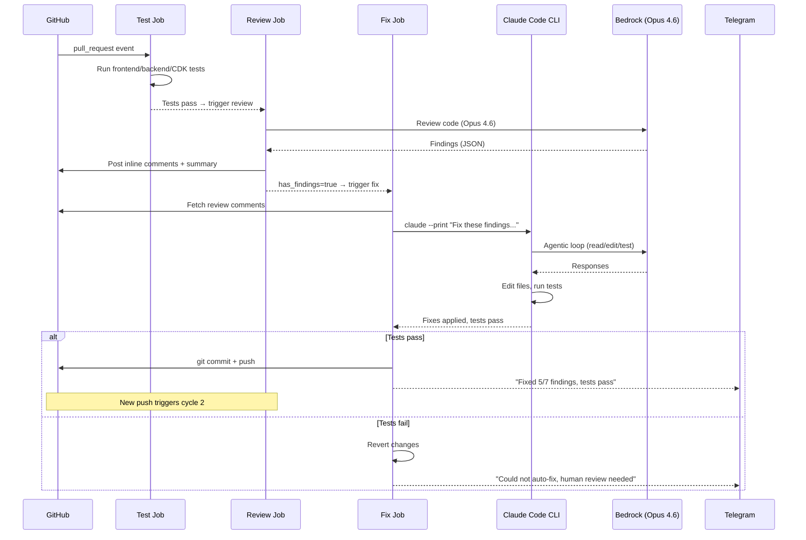

# Design Doc: Auto-Fix Agent for Code Review Findings

**Issue:** [#73](https://github.com/barakcaf/runmaprepeat/issues/73)
**Depends on:** [#57](https://github.com/barakcaf/runmaprepeat/issues/57) (AI Code Review Agent)
**Author:** Loki (AI assistant)
**Date:** 2026-03-25
**Status:** Draft

---

## Executive Summary

A third job in the PR workflow that uses Claude Code CLI (backed by Bedrock Opus 4.6) to automatically fix code review findings. It reads project steering docs, applies fixes, runs tests, and pushes — triggering a re-review that auto-resolves fixed comments and posts "✅ Ready for Merge" when clean.

---

## 1. Flow

### 1.1 End-to-End Flow

```
PR opened / push
         │
         ▼
┌─────────────────────┐
│  Job 1: test        │
│  frontend/backend/  │
│  CDK tests          │
└─────────┬───────────┘
          │
     Tests pass?
      │       │
     No      Yes
      │       ▼
      │  ┌──────────────────┐
      │  │  Job 2: review   │
      │  │  (AI Code Review)│
      │  └─────────┬────────┘
      │            │
      │     Has CRITICAL/HIGH/MEDIUM findings?
      │      │              │
      │     No             Yes
      │      │              │
      │      ▼              ▼
      │  ✅ Ready      ┌───────────────────┐
      │  for Merge     │  Job 3: fix       │
      │                │  (Auto-Fix Agent) │
      │                └─────────┬─────────┘
      │                          │
      │                Claude Code CLI:
      │                1. Read findings from review
      │                2. Read steering docs
      │                3. Fix code
      │                4. Run tests
      │                5. Tests pass? → Push commit
      │                   Tests fail? → Revert, log
      │                          │
      │                          ▼
      │                Push triggers new cycle:
      │                test → review → auto-resolve
      │                          │
      │                   Cycle ≤ 2?
      │                    │       │
      │                   Yes      No
      │                    │       │
      │                    ▼       ▼
      │              Continue   Stop, notify
      │              cycle      human via TG
      ▼
   ❌ Stop
```

### 1.2 Cycle Management

The fix agent and review agent form a feedback loop. To prevent infinite loops:

```
Cycle 1: push → test → review (finds issues) → fix → push
Cycle 2: push → test → review (checks again) → fix → push
Cycle 3: push → test → review → STOP (max cycles reached, notify human)
```

**Cycle tracking** via commit message convention:
- Fix agent commits: `fix: auto-resolve review findings [ai-fix-cycle-N]`
- Review job parses HEAD commit message — if `[ai-fix-cycle-2]` → skip fix job
- Simple, no external state needed

### 1.3 Sequence Diagram



---

## 2. Architecture

### 2.1 Components

| Component | Location | Purpose |
|-----------|----------|---------|
| Fix job | `.github/workflows/pr-review.yml` (job 3) | Orchestrates Claude Code CLI |
| Fix script | `.github/scripts/ai_fix.py` | Fetches findings, builds prompt, invokes Claude Code, pushes |
| Claude Code CLI | Installed at runtime (`npm i -g @anthropic-ai/claude-code`) | Agentic code editing with Bedrock |
| Steering docs | `CLAUDE.md`, `AGENTS.md`, `WORKFLOW.md` | Project conventions for Claude Code |

### 2.2 Workflow: Updated `pr-review.yml`

```yaml
jobs:
  test:
    name: Run Tests
    # ... existing test job ...

  review:
    name: AI Code Review
    needs: test
    outputs:
      has_findings: ${{ steps.review.outputs.has_findings }}
      findings_json: ${{ steps.review.outputs.findings_json }}
    # ... existing review job, now outputs findings ...

  fix:
    name: Auto-Fix Findings
    needs: review
    if: |
      needs.review.outputs.has_findings == 'true' &&
      !contains(github.event.pull_request.head.sha, '[ai-fix-cycle-2]')
    runs-on: ubuntu-latest
    permissions:
      contents: write
      pull-requests: write
      id-token: write

    steps:
      - name: Checkout PR branch
        uses: actions/checkout@v4
        with:
          ref: ${{ github.head_ref }}
          fetch-depth: 0
          token: ${{ secrets.GITHUB_TOKEN }}

      - name: Check cycle count
        id: cycle
        run: |
          LAST_MSG=$(git log -1 --pretty=%s)
          if [[ "$LAST_MSG" == *"[ai-fix-cycle-2]"* ]]; then
            echo "skip=true" >> $GITHUB_OUTPUT
            echo "Max fix cycles reached"
          elif [[ "$LAST_MSG" == *"[ai-fix-cycle-1]"* ]]; then
            echo "cycle=2" >> $GITHUB_OUTPUT
            echo "skip=false" >> $GITHUB_OUTPUT
          else
            echo "cycle=1" >> $GITHUB_OUTPUT
            echo "skip=false" >> $GITHUB_OUTPUT
          fi

      - name: Configure AWS credentials (OIDC)
        if: steps.cycle.outputs.skip != 'true'
        uses: aws-actions/configure-aws-credentials@v4
        with:
          role-to-assume: ${{ secrets.AWS_OIDC_ROLE_ARN }}
          aws-region: us-east-1

      - name: Setup Node.js
        if: steps.cycle.outputs.skip != 'true'
        uses: actions/setup-node@v4
        with:
          node-version: '22'

      - name: Setup Python
        if: steps.cycle.outputs.skip != 'true'
        uses: actions/setup-python@v5
        with:
          python-version: '3.12'

      - name: Install Claude Code CLI
        if: steps.cycle.outputs.skip != 'true'
        run: npm install -g @anthropic-ai/claude-code

      - name: Install project dependencies
        if: steps.cycle.outputs.skip != 'true'
        run: |
          cd frontend && npm ci && cd ..
          cd backend && pip install -r requirements.txt 2>/dev/null || true && pip install pytest moto boto3 && cd ..
          cd infra && pip install -r requirements.txt && cd ..

      - name: Run fix agent
        if: steps.cycle.outputs.skip != 'true'
        env:
          CLAUDE_CODE_USE_BEDROCK: "1"
          ANTHROPIC_MODEL: us.anthropic.claude-opus-4-6-v1
          AWS_REGION: us-east-1
          FINDINGS: ${{ needs.review.outputs.findings_json }}
          CYCLE: ${{ steps.cycle.outputs.cycle }}
        run: python .github/scripts/ai_fix.py

      - name: Notify Telegram
        if: always() && steps.cycle.outputs.skip != 'true'
        env:
          TELEGRAM_BOT_TOKEN: ${{ secrets.TELEGRAM_BOT_TOKEN }}
          TELEGRAM_CHAT_ID: ${{ secrets.TELEGRAM_CHAT_ID }}
        run: python .github/scripts/ai_fix_notify.py
```

### 2.3 Fix Script: `.github/scripts/ai_fix.py`

```python
"""Auto-fix agent — uses Claude Code CLI to fix review findings."""

import json
import os
import subprocess
import sys

def build_prompt(findings: list[dict], cycle: int) -> str:
    """Build the prompt for Claude Code."""
    prompt = (
        f"You are fixing code review findings (cycle {cycle}/2).\n\n"
        "For each finding below, fix the issue in the codebase.\n"
        "After fixing, run the test suites to verify:\n"
        "  - cd frontend && npm test -- --run\n"
        "  - cd backend && pytest --tb=short\n"
        "  - cd infra && pytest --tb=short\n\n"
        "If a fix breaks tests, revert that specific fix.\n"
        "Only keep fixes where tests still pass.\n\n"
        "IMPORTANT: Do not modify test files to make tests pass.\n"
        "Fix the source code, not the tests.\n\n"
        "## Findings to fix:\n\n"
    )
    for i, f in enumerate(findings, 1):
        sev = f.get("severity", "MEDIUM")
        title = f.get("title", "Issue")
        body = f.get("body", "")
        file = f.get("file", "")
        line = f.get("line", "?")
        suggestion = f.get("suggestion", "")

        prompt += f"### {i}. [{sev}] {title}\n"
        prompt += f"**File:** `{file}:{line}`\n"
        prompt += f"**Issue:** {body}\n"
        if suggestion:
            prompt += f"**Suggested fix:**\n```\n{suggestion}\n```\n"
        prompt += "\n"

    return prompt


def run_claude_code(prompt: str) -> tuple[bool, str]:
    """Run Claude Code CLI and return (success, output)."""
    result = subprocess.run(
        ["claude", "--print", "--permission-mode", "bypassPermissions", prompt],
        capture_output=True,
        text=True,
        timeout=600,  # 10 minute timeout
    )
    return result.returncode == 0, result.stdout + result.stderr


def run_tests() -> bool:
    """Run all test suites, return True if all pass."""
    suites = [
        ("frontend", ["npm", "test", "--", "--run"]),
        ("backend", ["pytest", "--tb=short"]),
        ("infra", ["pytest", "--tb=short"]),
    ]
    for name, cmd in suites:
        result = subprocess.run(cmd, cwd=name, capture_output=True)
        if result.returncode != 0:
            print(f"❌ {name} tests failed")
            return False
        print(f"✅ {name} tests passed")
    return True


def git_push(cycle: int) -> bool:
    """Commit and push fixes."""
    subprocess.run(["git", "add", "-A"], check=True)

    # Check if there are changes to commit
    result = subprocess.run(["git", "diff", "--cached", "--quiet"])
    if result.returncode == 0:
        print("No changes to commit")
        return False

    subprocess.run([
        "git", "commit", "-m",
        f"fix: auto-resolve review findings [ai-fix-cycle-{cycle}]"
    ], check=True)
    subprocess.run(["git", "push"], check=True)
    return True


def main():
    findings_json = os.environ.get("FINDINGS", "[]")
    cycle = int(os.environ.get("CYCLE", "1"))

    findings = json.loads(findings_json)
    if not findings:
        print("No findings to fix")
        return

    print(f"Fix agent cycle {cycle}/2 — {len(findings)} findings")

    # Build prompt and run Claude Code
    prompt = build_prompt(findings, cycle)
    success, output = run_claude_code(prompt)

    if not success:
        print(f"Claude Code failed:\n{output[:2000]}")
        sys.exit(1)

    # Verify tests pass
    if not run_tests():
        print("Tests failed after fixes — reverting")
        subprocess.run(["git", "checkout", "."], check=True)
        sys.exit(1)

    # Push
    if git_push(cycle):
        print(f"Fixes pushed (cycle {cycle}/2)")
    else:
        print("No fixes were applied")


if __name__ == "__main__":
    main()
```

### 2.4 Review Job Changes

The review job needs to output findings for the fix job to consume:

```python
# At end of main() in ai_review.py, add:
# Write findings as workflow output
findings_json = json.dumps(findings)
github_output = os.environ.get("GITHUB_OUTPUT", "")
if github_output:
    with open(github_output, "a") as f:
        f.write(f"has_findings={'true' if findings else 'false'}\n")
        # Escape for multiline output
        f.write(f"findings_json<<EOF\n{findings_json}\nEOF\n")
```

### 2.5 Auth & Permissions

| Resource | Permission | Why |
|----------|-----------|-----|
| Bedrock | `bedrock:Converse` + `bedrock:InvokeModel` | Claude Code CLI calls Opus via Bedrock |
| GitHub (contents) | `write` | Push fix commits to PR branch |
| GitHub (pull-requests) | `write` | Read review comments |
| GitHub (id-token) | `write` | OIDC federation for AWS |

Reuses existing `github-actions-ai-review` IAM role — no new infrastructure.

### 2.6 Claude Code + Bedrock Configuration

Claude Code CLI respects these environment variables:

| Variable | Value | Purpose |
|----------|-------|---------|
| `CLAUDE_CODE_USE_BEDROCK` | `1` | Use Bedrock instead of Anthropic API |
| `ANTHROPIC_MODEL` | `us.anthropic.claude-opus-4-6-v1` | Model to use |
| `AWS_REGION` | `us-east-1` | Bedrock region |

AWS credentials are provided by the OIDC step — Claude Code picks them up automatically from the environment.

### 2.7 Steering Docs

Claude Code automatically reads these from the repo root:
- **`CLAUDE.md`** — project-specific instructions, coding conventions
- **`AGENTS.md`** — agent behavior rules, safety constraints
- **`WORKFLOW.md`** — PR flow, test requirements, commit conventions

This means the fix agent follows the same rules a human developer would — including test requirements, code style, and safety constraints.

---

## 3. Safety & Guardrails

| Guardrail | Implementation |
|-----------|---------------|
| **Max 2 fix cycles** | Commit message tag `[ai-fix-cycle-N]`, job checks before running |
| **Tests must pass** | Fix agent runs all suites after fixing; reverts if tests fail |
| **No test modification** | Prompt explicitly forbids changing test files |
| **No force-push** | Regular commits only |
| **CRITICAL findings** | Fix attempted but always flagged for human in Telegram |
| **PR branch only** | Job condition checks `github.head_ref` exists (PR context only) |
| **Timeout** | 10-minute timeout on Claude Code CLI invocation |
| **Human override** | Adding label `no-auto-fix` skips the fix job |
| **Revert on failure** | `git checkout .` if tests fail after fixes |

### 3.1 Cycle Detection Detail

```
Push (human)           → commit msg: "feat: add spotify search"
  test → review → fix  → commit msg: "fix: auto-resolve review findings [ai-fix-cycle-1]"

Push (fix agent)       → commit msg contains [ai-fix-cycle-1]
  test → review → fix  → commit msg: "fix: auto-resolve review findings [ai-fix-cycle-2]"

Push (fix agent)       → commit msg contains [ai-fix-cycle-2]
  test → review         → fix job SKIPS (max cycles), sends Telegram alert
```

---

## 4. Design Decisions

| Decision | Choice | Rationale |
|----------|--------|-----------|
| Agent tool | Claude Code CLI + Bedrock | Full agentic capabilities, reads steering docs, runs tests, no Anthropic API key |
| Cycle limit | 2 rounds | Enough for most fixes, prevents infinite loops |
| Cycle tracking | Commit message tag | Simple, no external state, visible in git history |
| Fix scope | All severities attempted | Even CRITICAL should be attempted; human still reviews |
| Test verification | All suites after fix | Ensures fixes don't break anything |
| Revert strategy | Full revert on test failure | Conservative — partial fixes risk inconsistency |
| Push strategy | Regular commit | Force-push would lose review history |
| Skip label | `no-auto-fix` | Escape hatch for humans |

---

## 5. Cost Estimate

Claude Code CLI with Opus 4.6, ~5-10 fix runs/week:

| Component | Estimate |
|-----------|----------|
| Bedrock tokens per fix run | ~20-50K input + ~5-10K output (agentic loop) |
| Fix runs per week | 5-10 |
| Monthly Bedrock cost | **~$30-60/month** (on top of review costs) |
| GitHub Actions minutes | ~5-10 min per fix run × 10/week = ~100 min/week |

Combined with review agent: **~$50-85/month total** for fully automated PR review + fix.

---

## 6. Risks & Mitigations

| Risk | Likelihood | Impact | Mitigation |
|------|-----------|--------|------------|
| Fix introduces new bugs | Medium | High | Tests must pass; revert on failure |
| Infinite loop | Low | High | Max 2 cycles, commit message tracking |
| Claude Code CLI unavailable | Low | Low | Fix job fails, review still works, human notified |
| Bedrock rate limits | Low | Medium | 10-min timeout, sequential execution |
| Wrong fixes that pass tests | Medium | Medium | CRITICAL always flagged; human reviews before merge |
| Claude Code misreads steering docs | Low | Medium | Steering docs are well-structured; test verification catches most issues |
| Cost spikes from long agentic loops | Low | Medium | 10-min timeout, budget alerts |

---

## 7. Implementation Plan

| Phase | Tasks | Effort |
|-------|-------|--------|
| **1: Foundation** | Add `findings_json` output to review job, create `ai_fix.py`, add fix job to workflow | 2-3 hours |
| **2: Integration** | Test cycle detection, verify Claude Code + Bedrock auth in GH Actions, test revert logic | 1-2 hours |
| **3: Polish** | Telegram notifications, `no-auto-fix` label support, CRITICAL flagging | 1 hour |

### Phase 1 Checklist
- [ ] Update `ai_review.py` to output `has_findings` + `findings_json`
- [ ] Create `.github/scripts/ai_fix.py`
- [ ] Add `fix` job to `.github/workflows/pr-review.yml`
- [ ] Test Claude Code CLI + Bedrock auth in GitHub Actions
- [ ] Verify cycle detection with commit message tags
- [ ] Test revert on test failure
