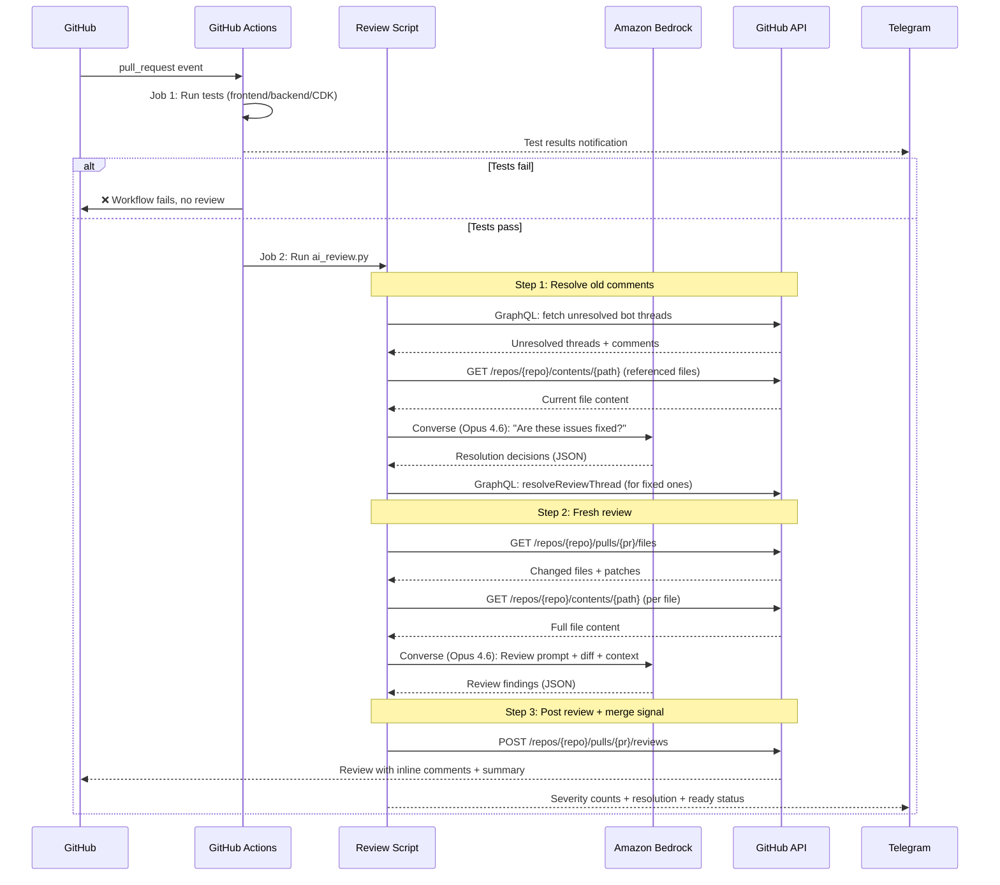

# Design Doc: AI Code Review Agent for RunMapRepeat

**Issue:** [#57](https://github.com/barakcaf/runmaprepeat/issues/57)
**Author:** Loki (AI assistant)
**Date:** 2026-03-25
**Status:** Implemented

---

## Executive Summary

An automated AI code review agent that runs on every PR via GitHub Actions. It uses Claude Opus 4.6 on Amazon Bedrock to review diffs, post inline comments, auto-resolve previously-fixed issues, and signal when a PR is ready for merge.

The agent is fully automated and gated behind tests — it only reviews code that passes all test suites. No human or assistant in the loop.

---

## 1. Review Flow

### 1.1 End-to-End Flow

```
PR opened / push / reopened
         │
         ▼
┌─────────────────────┐
│  Job 1: Run Tests   │
│  (frontend/backend/ │
│   CDK + Telegram)   │
└─────────┬───────────┘
          │
     Tests pass?
      │       │
      No      Yes
      │       │
      ▼       ▼
   ❌ Stop  ┌──────────────────────────────┐
            │  Job 2: AI Code Review       │
            │  (needs: test)               │
            │                              │
            │  1. Resolve old comments     │
            │     • Fetch unresolved bot   │
            │       threads (GraphQL)      │
            │     • Get current file code  │
            │     • Ask Opus: "is this     │
            │       fixed?"                │
            │     • Auto-resolve fixed     │
            │       threads                │
            │                              │
            │  2. Fresh code review        │
            │     • Fetch diff + full      │
            │       files via GitHub API   │
            │     • Send to Opus 4.6 with  │
            │       project context        │
            │     • Parse JSON findings    │
            │     • Post inline comments   │
            │       (CRITICAL/HIGH/MED)    │
            │     • Post summary review    │
            │                              │
            │  3. Merge decision           │
            │     • No new CRITICAL/HIGH   │
            │       AND no unresolved      │
            │       threads                │
            │     → "✅ Ready for Merge"   │
            │                              │
            │  4. Telegram notification    │
            │     • Severity counts        │
            │     • Resolution count       │
            │     • Ready status           │
            └──────────────────────────────┘
```

### 1.2 Sequence Diagram



### 1.3 Re-Review on Push

When new commits are pushed to a PR branch, the workflow triggers again (`synchronize` event):

1. **Old comments are checked** — the agent fetches all unresolved threads it previously posted, gets the current file content, and asks Opus if each issue has been fixed. Fixed threads are auto-resolved via GraphQL.
2. **Fresh review runs** on the current diff — new findings are posted as new inline comments.
3. **Ready for Merge** is evaluated — if no CRITICAL/HIGH findings remain (new or old), the signal is posted.

This creates a natural feedback loop: push → review → fix → push → old issues resolved + new review → Ready for Merge.

---

## 2. Review Categories

The review prompt instructs the model to check each file against these categories:

| # | Category | Focus |
|---|----------|-------|
| 1 | **Security** | Input validation, credential handling, CORS, XSS, IAM scope, public resources, injection |
| 2 | **Bugs & Error Handling** | Logic errors, missing try/catch, unhandled edge cases, wrong types, off-by-one |
| 3 | **AWS Best Practices** | Lambda timeout/memory, IAM least-privilege, DynamoDB pagination (1MB limit), CDK construct patterns |
| 4 | **Code Quality** | Typing, DRY violations, dead code, copy-paste artifacts, unclear logic |
| 5 | **Test Coverage** | Missing test cases for new/changed behavior, untested error paths |
| 6 | **Performance** | Unnecessary re-renders (React), missing useCallback/useMemo, redundant API calls, bundle size |
| 7 | **Data Integrity** | DynamoDB key schema violations, missing validation, decimal/float handling |

The prompt explicitly excludes: formatting, import order, trivial naming preferences, and "add a comment" suggestions.

### PR Type Awareness

The agent adjusts focus based on the PR type:
- **New feature:** Security, error handling, test coverage, edge cases
- **Bug fix:** Root cause verification, regression risk
- **Refactor:** Behavior preservation — flag accidental behavior changes
- **Dependency/config:** Breaking changes, version compatibility
- **Docs/CI:** Minimal — only factual errors or broken configs

---

## 3. Severity Levels & Merge Signal

| Level | Emoji | Meaning | Blocks Merge? |
|-------|-------|---------|---------------|
| CRITICAL | 🔴 | Security vulnerability or data loss | **Yes** |
| HIGH | 🟠 | Bug or significant gap | **Yes** |
| MEDIUM | 🟡 | Quality issue or minor bug | No |
| LOW | 🟢 | Improvement opportunity | No |

### Ready for Merge

The agent posts **"✅ Ready for Merge"** when ALL of:
- Zero new CRITICAL or HIGH findings
- Zero unresolved previous bot threads

This is the signal that the PR can be merged. Human approval is still required (the bot only posts `COMMENT`, never `APPROVE`).

---

## 4. Comment Format

### 4.1 Inline Comments (CRITICAL/HIGH/MEDIUM)

```
🟠 **HIGH: Short description**

Explanation of the issue with context on why it matters.

**Fix:**
```suggestion
# GitHub one-click apply suggestion
```
```

### 4.2 Review Body

```markdown
## 🤖 AI Code Review — #64: {title}

*Type: feature*

{1-2 sentence summary and overall assessment}

### 🟢 Highlights
- {What's done well}

### 🔄 Previous Comments
- ✅ **3** comment(s) auto-resolved (fixed by this push)
- ⏳ **1** comment(s) still unresolved

### Findings: 1 🟠 HIGH, 2 🟡 MEDIUM
See inline comments for details.

---

## ✅ Ready for Merge

No unresolved CRITICAL/HIGH findings. This PR is ready for human approval.
```

---

## 5. Architecture

### 5.1 Components

| Component | Location | Purpose |
|-----------|----------|---------|
| Workflow | `.github/workflows/pr-review.yml` | Two-job workflow: tests → AI review |
| Review script | `.github/scripts/ai_review.py` | Fetches diff, resolves old comments, calls Bedrock, posts review |
| Prompt template | `.github/prompts/review.md` | Editable prompt with project context and review rules |
| IAM role | `github-actions-ai-review` | OIDC-federated role for Bedrock access |

### 5.2 Auth: GitHub → AWS (OIDC Federation)

No long-lived AWS credentials stored in GitHub. The workflow uses OIDC federation:

```
GitHub Actions (OIDC provider)
    │
    ▼ (JWT token)
AWS IAM (trust policy: token.actions.githubusercontent.com)
    │
    ▼ (temporary credentials)
Amazon Bedrock (Converse — Claude Opus 4.6)
```

IAM role trust policy restricts to the specific repo:
```json
{
  "Condition": {
    "StringEquals": {
      "token.actions.githubusercontent.com:sub": "repo:barakcaf/runmaprepeat:*"
    }
  }
}
```

IAM permissions:
```json
{
  "Effect": "Allow",
  "Action": [
    "bedrock:InvokeModel",
    "bedrock:InvokeModelWithResponseStream",
    "bedrock:Converse",
    "bedrock:ConverseStream"
  ],
  "Resource": [
    "arn:aws:bedrock:*::foundation-model/anthropic.claude-*",
    "arn:aws:bedrock:*:<account>:inference-profile/*"
  ]
}
```

The role ARN is stored as GitHub secret `AWS_OIDC_ROLE_ARN` — never hardcoded in workflow files.

### 5.3 Workflow: `.github/workflows/pr-review.yml`

Single workflow file with two jobs:

```yaml
name: PR Tests & Review

on:
  pull_request:
    types: [opened, synchronize, reopened]

permissions:
  contents: read
  pull-requests: write
  checks: write
  id-token: write

jobs:
  test:
    name: Run Tests
    # Runs frontend (Vitest), backend (pytest), CDK (pytest)
    # Posts test results table on PR
    # Sends Telegram notification
    # Fails if any suite fails

  review:
    name: AI Code Review
    needs: test          # ← Only runs if ALL tests pass
    runs-on: ubuntu-latest
    if: github.actor != 'dependabot[bot]'
    steps:
      - Checkout
      - Configure AWS credentials (OIDC)
      - Set up Python 3.12
      - pip install boto3
      - Run ai_review.py
```

### 5.4 GitHub API Usage

| API | Method | Purpose |
|-----|--------|---------|
| `GET /repos/{repo}/pulls/{pr}` | REST | PR metadata (title, author, SHA) |
| `GET /repos/{repo}/pulls/{pr}/files` | REST (paginated) | Changed files + patches |
| `GET /repos/{repo}/contents/{path}` | REST | Full file content at HEAD |
| `POST /repos/{repo}/pulls/{pr}/reviews` | REST | Post review with inline comments |
| `pullRequest.reviewThreads` | GraphQL | Fetch unresolved bot threads |
| `resolveReviewThread` | GraphQL mutation | Auto-resolve fixed threads |

### 5.5 Bedrock Usage

- **Model:** `us.anthropic.claude-opus-4-6-v1` (cross-region inference profile)
- **API:** `Converse` (not `InvokeModel`)
- **Region:** us-east-1
- **Temperature:** 0.2 (deterministic, consistent reviews)
- **Max output tokens:** 4096
- **Two LLM calls per review:**
  1. Resolution check (if unresolved threads exist): "Are these issues fixed?"
  2. Code review: Full diff + context → structured findings

---

## 6. Safety & Guardrails

| Guardrail | Implementation |
|-----------|---------------|
| **Tests gate review** | `needs: test` — review job is skipped if any test fails |
| **Large PR bailout** | Max 15 files / 1500 changed lines — posts helpful message |
| **No merge blocking** | Posts `COMMENT` only — never `APPROVE` or `REQUEST_CHANGES` |
| **Confidence threshold** | 70% — don't flag speculative issues |
| **Max 10 findings** | Prioritized by severity, reduces comment fatigue |
| **File filtering** | Skips cdk.out/, node_modules/, images, lock files, .map files |
| **Diff scope only** | Don't flag pre-existing issues in unchanged code |
| **Fallback posting** | If inline comments fail (position mapping), retries as summary-only |
| **Robust JSON parsing** | Regex extraction → brace matching → multiple fallbacks |
| **Env var validation** | Fails fast with clear error if GITHUB_TOKEN/REPO_NAME/PR_NUMBER missing |
| **Error logging** | All GitHub API errors logged with status + response body |
| **Conservative resolution** | Only auto-resolves when Opus is confident the fix is correct |

---

## 7. Design Decisions

| Decision | Choice | Rationale |
|----------|--------|-----------|
| LLM | Claude Opus 4.6 via Bedrock | Best reasoning for code review, highest accuracy on complex issues |
| Test gate | `needs: test` in same workflow | Simple, reliable — no cross-workflow trigger complexity |
| Auth | OIDC federation (GitHub → AWS IAM) | No long-lived secrets, industry best practice |
| Comment resolution | GraphQL + LLM check | Closes the feedback loop — old comments don't pile up |
| Merge signal | "✅ Ready for Merge" comment | Clear signal, no bot approvals, human still decides |
| Single workflow | Tests + review in `pr-review.yml` | `workflow_run` only works from default branch — single file is simpler |
| Comment style | Inline (HIGH+) + summary | Line-specific feedback + overview |
| Output format | JSON from LLM → script parses | Reliable, easy to map to GitHub API |
| Review event | `COMMENT` (never APPROVE) | Bot should never block — human approval required |
| Telegram | Direct HTTP from script | No extra infrastructure, optional (skipped if not configured) |

---

## 8. Cost Estimate

Using Opus 4.6 for ~5-10 PRs/week, averaging 500 lines changed per PR:

| Component | Estimate |
|-----------|----------|
| Bedrock Opus input tokens | ~8K tokens/PR × 2 calls × 10 PRs = 160K tokens/week |
| Bedrock Opus output tokens | ~3K tokens/PR × 2 calls × 10 PRs = 60K tokens/week |
| Monthly cost | **~$15-25/month** (Opus pricing) |
| GitHub Actions minutes | Free tier (2,000 min/month for public repos) |

---

## 9. Risks and Mitigations

| Risk | Likelihood | Impact | Mitigation |
|------|-----------|--------|------------|
| **False positives / noise** | Medium | Medium | 70% confidence threshold, severity filtering, max 10 findings |
| **Hallucinated suggestions** | Low | Medium | Full file context (not just diff), human reviewer has final say |
| **Auto-resolve wrong** | Low | Medium | Conservative resolution — only when Opus is confident |
| **Context window overflow** | Low | Low | 15 file / 1500 line limit with helpful bailout message |
| **Bedrock rate limits** | Low | Low | Single PR at a time, sequential API calls |
| **Cost with Opus** | Medium | Low | ~$20/month for typical usage, budget alerts on AWS account |
| **Over-reliance** | Low | High | Bot never approves — human approval required for merge |
| **GraphQL permission** | Low | Low | GITHUB_TOKEN has pull-requests:write which covers thread resolution |

---

## 10. Alternatives Considered

| Option | Pros | Cons | Verdict |
|--------|------|------|---------|
| GitHub Copilot Review | Zero setup, native UX | Subscription, limited customization, no Bedrock | Less tailored |
| CodeRabbit SaaS | Best-in-class quality | External SaaS, data leaves repo, paid | Overkill for personal project |
| Sonnet instead of Opus | Cheaper (~$1/month) | Lower accuracy on complex issues | Opus chosen for quality |
| Separate workflow file | Cleaner separation | `workflow_run` doesn't work from PR branches | Merged into single file |
| Lambda + webhook | More control | Unnecessary infrastructure for this use case | GitHub Actions is simpler |

**Selected: Custom script + Opus 4.6 + single-workflow gate**

Minimal code, full control, no external dependencies, gated behind tests, auto-resolves feedback loop, clear merge signal.
