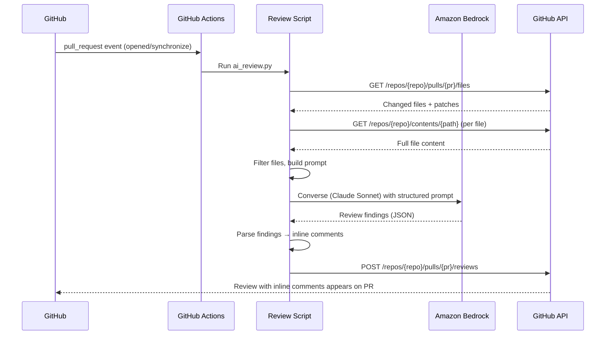

# Design Doc: AI Code Review Agent for RunMapRepeat

**Issue:** [#57](https://github.com/barakcaf/runmaprepeat/issues/57)
**Author:** Loki (AI assistant)
**Date:** 2026-03-24
**Status:** Draft

---

## Executive Summary

An automated AI code review bot that runs on every PR via GitHub Actions. It calls Claude Sonnet on Amazon Bedrock to review the diff, then posts inline comments and a summary directly on the PR — following the same structured review flow proven on PRs #64/#65 (Spotify integration).

The bot is fully automated: PR open/update triggers the workflow, Bedrock performs the review, results are posted as GitHub PR review comments. No human or assistant in the loop.

---

## 1. Review Flow

### 1.1 End-to-End Flow

```
PR opened / updated (push to PR branch)
    │
    ▼
GitHub Actions workflow triggers
    │
    ▼
Review script (.github/scripts/ai_review.py)
    │
    ├── 1. Fetch PR metadata (title, description, author)
    ├── 2. Fetch changed files + full file content via GitHub API
    ├── 3. Filter files (skip *.md, *.json, cdk.out/, node_modules/)
    ├── 4. Build structured prompt (project context + review categories + diff)
    ├── 5. Call Amazon Bedrock (Claude Sonnet) via ConverseAPI
    ├── 6. Parse structured response into findings
    │
    ▼
Post review via GitHub API (pulls/reviews endpoint)
    ├── Review body: summary + highlights + finding counts
    ├── Inline comments: one per finding (severity + explanation + fix suggestion)
    └── Event type: COMMENT (bot cannot approve/block)
```

### 1.2 Sequence Diagram



### 1.3 Re-Review on Push

When new commits are pushed to a PR branch, the workflow triggers again (`synchronize` event). The script reviews only the files changed in the latest push, avoiding duplicate comments on already-reviewed code. Previous bot reviews are not deleted — they remain as a history of what was flagged.

---

## 2. Review Categories

The review prompt instructs the model to check each file against these categories:

| Category | What to check |
|----------|---------------|
| **Security** | Credential handling, input validation, CORS, XSS, open redirects, IAM permissions, public resources |
| **Error handling** | Missing try/catch, unhandled edge cases, error propagation, missing validation |
| **Code quality** | Typing, naming, DRY, structure, dead code, copy-paste artifacts |
| **AWS best practices** | Lambda patterns (cold start, timeout, memory), IAM scope, CDK constructs, DynamoDB pagination |
| **Test coverage** | Missing test cases, untested edge cases, test quality |
| **Performance** | Unnecessary re-renders (React), bundle size, redundant API calls, memory leaks |
| **Compliance** | Third-party ToS (e.g., Spotify branding), accessibility (ARIA), licensing |

The prompt explicitly excludes: formatting, import order, trivial naming preferences, and "add a comment" suggestions.

---

## 3. Severity Levels

Each finding is assigned a severity level that maps to a required action:

| Level | Emoji | Meaning | Action |
|-------|-------|---------|--------|
| CRITICAL | 🔴 | Security vulnerability or data loss risk | Must fix before merge |
| HIGH | 🟠 | Bug, missing error handling, or security hardening gap | Must fix before merge |
| MEDIUM | 🟡 | Code quality, minor bugs, missing validation, UX issues | Should fix (can be follow-up) |
| LOW | 🟢 | Style, minor improvements, optional optimizations | Nice to have |
| NIT | 📝 | Trivial observations | Ignore or fix opportunistically |

The bot only posts **CRITICAL**, **HIGH**, and **MEDIUM** findings as inline comments by default. LOW and NIT findings are included in the summary comment only, to reduce noise.

---

## 4. Comment Format

### 4.1 Inline Comments

Each inline comment on a specific line follows this format:

```
🟠 **HIGH: Short description**

Explanation of the issue with context on why it matters.

**Fix:**
```python
# Suggested code change
```
```

When the fix is a simple replacement, use GitHub's suggested changes format for one-click apply:

````
🟡 **MEDIUM: No query length limit**

Any-length query gets forwarded directly to the API.

```suggestion
if len(query) > 256:
    return {"statusCode": 400, "body": json.dumps({"error": "Query too long"})}
```
````

### 4.2 Review Body

The review body (top-level comment) includes:

```markdown
## AI Code Review — PR #64: {title}

{1-2 sentence summary of what the PR does and overall assessment}

### 🟢 Highlights
- {What's done well — 2-4 bullet points}

### Findings: {N} HIGH, {N} MEDIUM, {N} LOW
See inline comments for details.

{If any LOW/NIT findings not posted inline:}
### Low Priority
- **L1:** {description} — `{filename}:{line}`
- **N1:** {description} — `{filename}:{line}`
```

---

## 5. Architecture

### 5.1 Components

| Component | Location | Purpose |
|-----------|----------|---------|
| GitHub Actions workflow | `.github/workflows/ai-review.yml` | Triggers on PR events, authenticates to AWS via OIDC |
| Review script | `.github/scripts/ai_review.py` | Fetches diff, builds prompt, calls Bedrock, posts review |
| Prompt template | `.github/prompts/review.md` | Editable prompt with project context and review rules |
| IAM role | `github-actions-ai-review` | OIDC-federated role with `bedrock:InvokeModel` only |

### 5.2 Auth: GitHub → AWS (OIDC Federation)

No long-lived AWS credentials stored in GitHub. The workflow uses OIDC federation:

```
GitHub Actions (OIDC provider)
    │
    ▼ (JWT token)
AWS IAM (trust policy: token.actions.githubusercontent.com)
    │
    ▼ (temporary credentials)
Amazon Bedrock (InvokeModel — Claude Sonnet)
```

IAM role trust policy restricts to the specific repo:
```json
{
  "Condition": {
    "StringEquals": {
      "token.actions.githubusercontent.com:sub": "repo:barakcaf/runmaprepeat:*"
    }
  }
}
```

IAM permissions — minimal scope:
```json
{
  "Effect": "Allow",
  "Action": ["bedrock:InvokeModel"],
  "Resource": ["arn:aws:bedrock:us-east-1::foundation-model/anthropic.claude-sonnet-*"]
}
```

### 5.3 Workflow File: `.github/workflows/ai-review.yml`

```yaml
name: AI Code Review

on:
  pull_request:
    types: [opened, synchronize, reopened]

permissions:
  contents: read
  pull-requests: write
  id-token: write  # OIDC federation

jobs:
  review:
    runs-on: ubuntu-latest
    if: github.actor != 'dependabot[bot]'
    steps:
      - uses: actions/checkout@v4
        with:
          fetch-depth: 0

      - name: Configure AWS credentials (OIDC)
        uses: aws-actions/configure-aws-credentials@v4
        with:
          role-to-assume: arn:aws:iam::${{ secrets.AWS_ACCOUNT_ID }}:role/github-actions-ai-review
          aws-region: us-east-1

      - name: Set up Python
        uses: actions/setup-python@v5
        with:
          python-version: '3.12'

      - name: Install dependencies
        run: pip install boto3 PyGithub

      - name: Run AI review
        env:
          GITHUB_TOKEN: ${{ secrets.GITHUB_TOKEN }}
          PR_NUMBER: ${{ github.event.pull_request.number }}
          REPO_NAME: ${{ github.repository }}
        run: python .github/scripts/ai_review.py
```

### 5.4 Prompt Template: `.github/prompts/review.md`

```markdown
You are a senior developer reviewing a pull request for RunMapRepeat,
a personal exercise tracker app.

## Tech Stack
- Frontend: React 18 + Vite + TypeScript (CSS Modules)
- Backend: AWS Lambda (Python 3.12, stdlib only — no external deps)
- Infrastructure: AWS CDK (Python)
- CI/CD: AWS CodeBuild + CodePipeline
- Auth: Amazon Cognito
- Database: DynamoDB (single-table)

## Review Categories
Check each changed file against these categories:
1. Security — credentials, input validation, CORS, XSS, IAM
2. Error handling — missing try/catch, unhandled edge cases
3. Code quality — typing, naming, DRY, dead code
4. AWS best practices — Lambda cold start, IAM scope, DynamoDB pagination
5. Test coverage — missing tests, untested edge cases
6. Performance — re-renders, bundle size, memory
7. Compliance — third-party ToS, accessibility

## Rules
- Assign severity: CRITICAL, HIGH, MEDIUM, LOW, or NIT
- Only report actual issues — no praise-only comments
- DO NOT comment on: formatting, import order, naming preferences, adding comments
- Include a concrete fix suggestion for each finding
- For simple fixes, use GitHub suggested changes format

## Output Format (JSON)
Respond with valid JSON only:
{
  "summary": "1-2 sentence overview",
  "highlights": ["what's done well"],
  "findings": [
    {
      "severity": "HIGH",
      "file": "backend/data/spotify.py",
      "line": 75,
      "title": "No error handling for token exchange",
      "body": "Explanation...",
      "suggestion": "optional code suggestion"
    }
  ]
}
```

### 5.5 Review Script: `.github/scripts/ai_review.py`

High-level pseudocode:

```python
def main():
    # 1. Fetch PR data
    pr = github.get_pr(repo, pr_number)
    files = pr.get_files()

    # 2. Filter
    files = [f for f in files if not should_skip(f.filename)]

    # 3. Build prompt
    prompt = load_template(".github/prompts/review.md")
    for f in files:
        prompt += f"\n### {f.filename}\n```diff\n{f.patch}\n```\n"
        prompt += f"Full file:\n```\n{get_file_content(f.filename)}\n```\n"

    # 4. Call Bedrock
    response = bedrock.converse(
        modelId="anthropic.claude-sonnet-4-20250514-v1:0",
        messages=[{"role": "user", "content": prompt}],
    )
    findings = json.loads(response)

    # 5. Post review
    comments = []
    for f in findings["findings"]:
        if f["severity"] in ("CRITICAL", "HIGH", "MEDIUM"):
            comments.append({
                "path": f["file"],
                "line": f["line"],
                "body": format_comment(f),
            })

    pr.create_review(
        body=format_summary(findings),
        event="COMMENT",
        comments=comments,
    )

def format_comment(finding):
    emoji = {"CRITICAL": "🔴", "HIGH": "🟠", "MEDIUM": "🟡"}[finding["severity"]]
    body = f'{emoji} **{finding["severity"]}: {finding["title"]}**\n\n{finding["body"]}'
    if finding.get("suggestion"):
        body += f'\n\n**Fix:**\n```suggestion\n{finding["suggestion"]}\n```'
    return body

def should_skip(filename):
    skip_patterns = [".md", ".json", "cdk.out/", "node_modules/", "__pycache__/"]
    return any(filename.endswith(p) or p in filename for p in skip_patterns)
```

---

## 6. Design Decisions

| Decision | Choice | Rationale |
|----------|--------|-----------|
| LLM | Claude Sonnet 4 via Bedrock | Best reasoning for code review, already in AWS account, cost-effective |
| Trigger | GitHub Actions `pull_request` event | Zero infra, automatic, no webhook/Lambda needed |
| Auth to Bedrock | OIDC federation (GitHub → AWS IAM Role) | No long-lived secrets, industry best practice |
| Comment style | Inline comments + summary | Line-specific feedback + overview — matches proven PR #64/#65 format |
| Review scope | Changed files only, with full file context | Balance between context and token cost |
| Noise control | Severity filtering (inline = HIGH+, summary = all) | Reduce comment fatigue while preserving visibility |
| File filtering | Skip non-code files | Don't waste tokens on generated/config files |
| Output format | JSON from LLM → parsed by script | Reliable parsing, easy to map to GitHub API |
| Re-review | On push (synchronize event) | Incremental, catches fixes and regressions |
| Review event | COMMENT (not APPROVE/REQUEST_CHANGES) | Bot should never block — human approval required |

---

## 7. Implementation Plan

| Phase | Tasks | Effort |
|-------|-------|--------|
| **1: MVP** | IAM OIDC role, `ai_review.py` script, workflow file, prompt template, test on real PR | 2-3 hours |
| **2: Refinement** | File filtering, large PR chunking, prompt as separate file, token usage logging | 1-2 hours |
| **3: Polish** | `/review` slash command, severity filtering config, `.github/review-rules.yml` | 1 hour |

### Phase 1 Checklist
- [ ] Create IAM role `github-actions-ai-review` with OIDC trust + `bedrock:InvokeModel`
- [ ] Store AWS account ID as GitHub repo secret
- [ ] Write `.github/scripts/ai_review.py` (~200 lines)
- [ ] Write `.github/prompts/review.md` (prompt template)
- [ ] Add `.github/workflows/ai-review.yml`
- [ ] Test on a real PR and tune prompt based on output quality

---

## 8. Cost Estimate

For ~5-10 PRs/week, averaging 500 lines changed per PR:

| Component | Estimate |
|-----------|----------|
| Bedrock Claude Sonnet input tokens | ~5K tokens/PR × 10 PRs = 50K tokens/week |
| Bedrock Claude Sonnet output tokens | ~2K tokens/PR × 10 PRs = 20K tokens/week |
| Monthly cost | **< $1/month** |
| GitHub Actions minutes | Free tier (2,000 min/month for private repos) |

---

## 9. Risks and Mitigations

| Risk | Likelihood | Impact | Mitigation |
|------|-----------|--------|------------|
| **False positives / noise** | High | Medium | Strict prompt rules (no formatting nits), severity filtering, start conservative and tune |
| **Hallucinated suggestions** | Medium | Medium | Always include full file context (not just diff), human reviewer has final say |
| **Context window overflow** | Low | Low | File chunking for large PRs, skip non-code files |
| **Bedrock rate limits** | Low | Low | Single PR at a time, exponential backoff |
| **Cost runaway** | Very Low | Low | Hard token limit in script, budget alert on AWS account |
| **Over-reliance on AI review** | Low | High | Bot posts COMMENT only, never APPROVE — human approval still required |
| **Prompt injection via PR content** | Low | Medium | Sanitize PR description, review-only permissions |
| **Stale prompts** | Medium | Low | Keep prompt template in repo, update as conventions evolve |

---

## 10. Alternatives Considered

### Option A: GitHub Copilot Code Review (Built-in)
- **Pros**: Zero setup, native UX
- **Cons**: Copilot subscription, limited customization (4K chars), can't use Bedrock
- **Verdict**: Less tailored, costs money

### Option B: CodeRabbit SaaS
- **Pros**: Best-in-class quality, learns from feedback
- **Cons**: External SaaS, data leaves repo, paid for private repos
- **Verdict**: Overkill for a personal project

### Option C: Fork `ai-pr-reviewer` + Bedrock support
- **Pros**: Battle-tested, incremental review, conversation support
- **Cons**: Repo in maintenance mode, significant code to understand
- **Verdict**: More effort than custom script

### **Selected: Custom script + Bedrock**
Minimal code, full control, no external dependencies, uses existing AWS infrastructure. Review format proven on PRs #64/#65.

---

## Appendix A: Research Findings

### How Teams Use LLMs for Code Review

The dominant pattern is: **on PR open/update → fetch diff → send diff + context to LLM → post comments back to PR**. Key learnings:

- **Greptile's data** (2.2M+ PRs): 69.5% of PRs have at least one issue flagged. 48% are logic errors, not style. 58% of comments rated helpful.
- **Separation of concerns**: The tool that generates code should NOT review it. Independent review catches shared blind spots.
- **Noise is the #1 killer**: If every PR gets a wall of comments, developers ignore them within a week.
- **Cross-file context is where AI shines**: Catching logic issues that span multiple files — something humans do poorly under time pressure.

### Prompt Engineering Key Lessons

1. **Role definition** + **project context** = most impactful improvement
2. **Structured output (JSON)** = reliable parsing for GitHub API
3. **Negative examples** ("DO NOT comment on formatting") = essential for noise control
4. **Severity levels** = developers triage findings effectively
5. **Full file context** (not just diff) = prevents hallucinated suggestions

### What AI Reviews Well vs. Leave to Humans

| AI reviews well | Leave to humans |
|----------------|-----------------|
| Logic bugs, missing error handling | Architecture decisions |
| Security issues, IAM anti-patterns | UX/design choices |
| CDK/CloudFormation anti-patterns | Business logic correctness |
| React anti-patterns | Trade-off discussions |
| Convention violations | Whether a feature should exist |
| Missing tests | |

---

## Appendix B: Key References

1. Greptile — "What Developers Need to Know About AI Code Reviews" — [greptile.com/blog/ai-code-review](https://www.greptile.com/blog/ai-code-review)
2. GitHub Copilot Code Review docs — [docs.github.com](https://docs.github.com/en/copilot/using-github-copilot/code-review/using-copilot-code-review)
3. CodeRabbit ai-pr-reviewer — [github.com/coderabbitai/ai-pr-reviewer](https://github.com/coderabbitai/ai-pr-reviewer)
4. ChatGPT-CodeReview — [github.com/anc95/ChatGPT-CodeReview](https://github.com/anc95/ChatGPT-CodeReview)
5. Anthropic prompt engineering — [docs.anthropic.com](https://docs.anthropic.com/en/docs/build-with-claude/prompt-engineering/overview)
