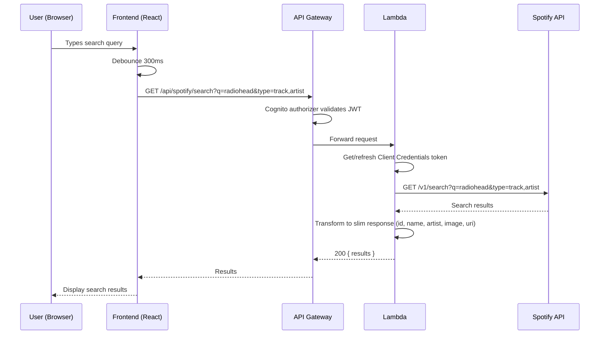
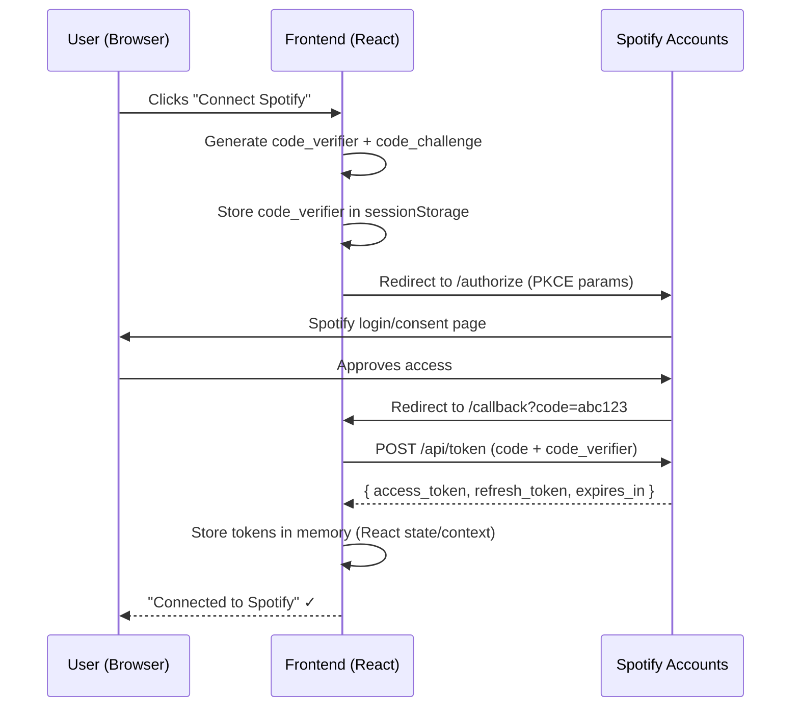
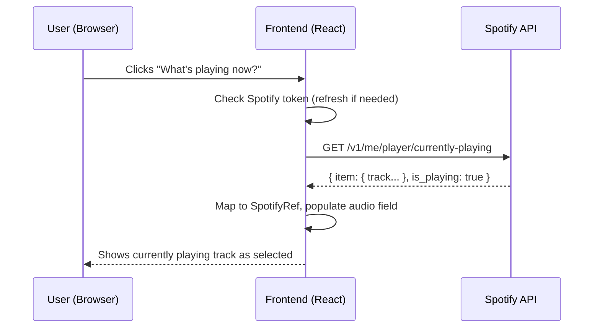

# Spotify Integration Design Document

**Author:** Claude (AI-assisted research)
**Date:** 2026-03-24
**Status:** Proposal
**Issue:** #22

---

## Executive Summary

RunMapRepeat currently stores free-text music/podcast info on runs via an `audio` field (type, subtype, name, detail). This proposal upgrades that to integrate with the Spotify Web API, enabling users to search for and link real Spotify tracks, artists, albums, and playlists when logging a run. Linked items display artwork, clickable links to Spotify, and accurate metadata.

**Recommended approach:** Hybrid (Option C) — PKCE auth handled in the frontend SPA, Spotify search proxied through our Lambda backend. This balances security, UX, rate-limit control, and implementation complexity.

---

## Table of Contents

1. [Spotify API Overview](#1-spotify-api-overview)
2. [Authentication Flow Options](#2-authentication-flow-options)
3. [Integration Architecture Options](#3-integration-architecture-options)
4. [Data Model Changes](#4-data-model-changes)
5. [UX Design](#5-ux-design)
6. [Architecture](#6-architecture)
7. [Implementation Phases](#7-implementation-phases)
8. [Risks and Mitigations](#8-risks-and-mitigations)
9. [Spotify ToS Compliance Checklist](#9-spotify-tos-compliance-checklist)
10. [Decision: Recommended Approach](#10-decision-recommended-approach)

---

## 1. Spotify API Overview

### Base URL

```
https://api.spotify.com/v1
```

### Relevant Endpoints

| Endpoint | Method | Auth | Scope Required | Description |
|----------|--------|------|---------------|-------------|
| `/search?q={query}&type={types}` | GET | User or App token | None (public data) | Search tracks, artists, albums, playlists |
| `/me/player/recently-played` | GET | User token | `user-read-recently-played` | Last 50 played tracks with timestamps |
| `/me/player/currently-playing` | GET | User token | `user-read-currently-playing` | Currently playing track/episode |
| `/tracks/{id}` | GET | Any token | None | Get track metadata by ID |
| `/artists/{id}` | GET | Any token | None | Get artist metadata by ID |
| `/albums/{id}` | GET | Any token | None | Get album metadata by ID |
| `/playlists/{id}` | GET | Any token | None | Get playlist metadata by ID |

### Search API Details

- **Query parameter `q`:** Supports field filters (`artist:Radiohead`, `track:Creep`, `album:OK Computer`, `year:1997`, `genre:rock`)
- **Type parameter:** Comma-separated: `track`, `artist`, `album`, `playlist`, `show`, `episode`
- **Pagination:** `limit` (default 5, max 10 per type), `offset` (max 1000)
- **Market:** ISO 3166-1 alpha-2 code; defaults to user's account country

### Recently Played Tracks

- Returns up to 50 items with cursor-based pagination (`before`/`after` Unix timestamps)
- Each item includes: full track object, `played_at` timestamp, playback context
- **Limitation:** Does not support podcast episodes

### Currently Playing Track

- Returns: track/episode object, `is_playing` boolean, `progress_ms`, device info
- Returns `null` item if nothing is playing
- Supports `additional_types=episode` for podcast detection

### Required OAuth Scopes

For our integration, we need:

| Scope | Purpose |
|-------|---------|
| `user-read-recently-played` | "What were you listening to?" feature |
| `user-read-currently-playing` | "Link what's playing now" feature |

**Note:** Search does not require user scopes — it works with any valid token, including Client Credentials tokens.

### Rate Limits

- Rolling 30-second window per app
- Development mode: lower limits (exact numbers undisclosed)
- Extended quota mode: higher limits (requires Spotify approval)
- 429 response with `Retry-After` header when exceeded
- Best practices: batch endpoints, debounce search, lazy loading

### App Registration

- Development mode: limited to 25 allowlisted users
- Extended quota: requires application via Spotify Dashboard
- Client ID is public (safe for SPA); Client Secret must never be in frontend code

---

## 2. Authentication Flow Options

### Authorization Code with PKCE (Recommended for SPAs)

This is Spotify's recommended flow for browser-based apps. No client secret required.

**Flow:**

1. Generate random `code_verifier` (43-128 chars)
2. Derive `code_challenge` = base64url(SHA-256(code_verifier))
3. Redirect user to `https://accounts.spotify.com/authorize` with:
   - `client_id`, `response_type=code`, `redirect_uri`, `scope`
   - `code_challenge_method=S256`, `code_challenge`
   - `state` (CSRF protection)
4. User approves; Spotify redirects back with `?code=...`
5. Exchange code for tokens via POST to `https://accounts.spotify.com/api/token`:
   - `grant_type=authorization_code`, `code`, `redirect_uri`, `client_id`, `code_verifier`
6. Receive: `access_token` (1 hour), `refresh_token`, `scope`, `token_type=Bearer`
7. Use `refresh_token` to get new access tokens without re-auth

**Security properties:**
- No client secret in frontend code
- PKCE prevents authorization code interception
- Refresh tokens enable long-lived sessions

### Client Credentials Flow (Backend only, no user context)

- Backend exchanges `client_id` + `client_secret` for app-level token
- Can only access public endpoints (search, get track/artist/album by ID)
- Cannot access user-specific data (recently played, currently playing)

### Implicit Grant (Deprecated)

- Spotify still supports but discourages
- No refresh tokens — user must re-auth every hour
- Not recommended for new applications

---

## 3. Integration Architecture Options

### Option A: Frontend-Only (SPA calls Spotify directly with PKCE)

```
Browser → Spotify Auth (PKCE) → Spotify API
Browser → Our API Gateway → Lambda → DynamoDB
```

**Pros:**
- Simplest backend — no Spotify code in Lambda at all
- Lower latency for search (direct browser→Spotify)
- Fewer Lambda invocations

**Cons:**
- Spotify Client ID exposed in frontend (acceptable per Spotify docs, but visible)
- Rate limits tracked per app, harder to control from distributed clients
- Token management entirely in browser (localStorage/sessionStorage)
- No server-side validation of Spotify data before storage
- CORS dependency on Spotify's headers

### Option B: Backend Proxy (Lambda handles all Spotify calls)

```
Browser → API Gateway → Lambda → Spotify API
                              → DynamoDB
```

**Pros:**
- Client Secret stays server-side (enables Client Credentials for search)
- Centralized rate-limit management and caching
- Server validates all Spotify data before storage
- Single auth flow for users (just our Cognito)

**Cons:**
- Higher complexity — Lambda needs Spotify token management
- Every search keystroke = Lambda invocation + Spotify call (latency + cost)
- Must store/manage Spotify refresh tokens server-side (security responsibility)
- User auth with Spotify still needs browser redirect, complicating the flow

### Option C: Hybrid (Recommended)

```
Browser → Spotify Auth (PKCE)  [user connects Spotify account]
Browser → Our API Gateway → Lambda → Spotify Search API  [proxied search]
Browser → Spotify API directly  [recently played, currently playing]
```

**Pros:**
- Search proxied through backend: enables caching, rate-limit control, data validation
- User-scoped endpoints (recently played, currently playing) called from frontend with user's token — no need to store Spotify tokens server-side
- Backend uses Client Credentials for search (no user token needed)
- Clean separation: backend owns search/metadata, frontend owns user-context features
- Spotify tokens never touch our backend/DynamoDB

**Cons:**
- More complex than Option A (but not by much)
- Two token flows: Cognito (our auth) + Spotify PKCE (Spotify features)

### Option D: Simple URL Paste + Server-Side Resolution

```
User pastes Spotify URL → Backend resolves metadata via Spotify API → stores in DynamoDB
```

**Pros:**
- Simplest UX (just paste a link)
- No Spotify OAuth needed for users (backend uses Client Credentials)
- Minimal frontend changes

**Cons:**
- Poor UX — requires user to find URL in Spotify app, copy, switch apps, paste
- No search, no "what am I listening to now?" features
- No browse/discover experience
- Loses the core value proposition of the integration

### Comparison Matrix

| Criterion | A: Frontend | B: Backend | C: Hybrid | D: URL Paste |
|-----------|:-----------:|:----------:|:---------:|:------------:|
| UX Quality | Good | Good | Best | Poor |
| Implementation Complexity | Low | High | Medium | Low |
| Security | Good | Best | Good | Best |
| Rate Limit Control | Poor | Best | Good | Best |
| Latency (search) | Best | Poor | Good | N/A |
| Lambda Cost | None | High | Medium | Low |
| Token Management | Frontend | Backend | Split | None |
| Spotify Account Required | Yes | Yes | Yes | No |

---

## 4. Data Model Changes

### Current Audio Field (DynamoDB)

```typescript
// frontend/src/types/run.ts
interface MusicAudio {
  type: "music";
  subtype: "artist" | "playlist";
  name: string;
  detail?: string;
  format?: "album" | "mix";
}

interface PodcastAudio {
  type: "podcast";
  name: string;
  detail?: string;
}

type Audio = MusicAudio | PodcastAudio;
```

### Proposed Audio Field (v2)

```typescript
// Spotify-linked item metadata
interface SpotifyRef {
  spotifyId: string;          // Spotify ID (e.g., "4iV5W9uYEdYUVa79Axb7Rh")
  spotifyUri: string;         // URI (e.g., "spotify:track:4iV5W9uYEdYUVa79Axb7Rh")
  spotifyUrl: string;         // Web URL (e.g., "https://open.spotify.com/track/...")
  spotifyType: "track" | "artist" | "album" | "playlist";
  name: string;               // Track/artist/album/playlist name
  artistName?: string;        // Primary artist (for tracks/albums)
  albumName?: string;         // Album name (for tracks)
  imageUrl?: string;          // Album art / artist photo URL (smallest suitable size)
  previewUrl?: string;        // 30-second preview URL (if available)
}

// Updated Audio type — backwards-compatible union
interface ManualAudio {
  source: "manual";
  type: "music" | "podcast";
  subtype?: "artist" | "playlist";
  name: string;
  detail?: string;
  format?: "album" | "mix";
}

interface SpotifyAudio {
  source: "spotify";
  spotify: SpotifyRef;
}

type AudioV2 = ManualAudio | SpotifyAudio;
```

### Migration Strategy

**Approach: In-place migration with backwards compatibility**

1. **Read path:** When reading a run, if `audio` lacks a `source` field, treat it as `ManualAudio` with `source: "manual"` (add in the data layer read function).
2. **Write path:** New writes always include `source` field.
3. **No batch migration needed** — lazy migration on read handles existing data.
4. **Validation:** Backend `validate_audio()` updated to accept both old and new formats.

```python
# backend/data/runs.py — migration on read
def _normalize_audio(audio: dict) -> dict:
    """Ensure audio has source field for backwards compat."""
    if audio and "source" not in audio:
        audio["source"] = "manual"
    return audio
```

### DynamoDB Storage

The `audio` attribute on run items stores either format as a Map:

```json
// Manual entry (migrated from v1)
{
  "source": "manual",
  "type": "music",
  "subtype": "artist",
  "name": "Radiohead",
  "detail": "OK Computer",
  "format": "album"
}

// Spotify-linked track
{
  "source": "spotify",
  "spotify": {
    "spotifyId": "4iV5W9uYEdYUVa79Axb7Rh",
    "spotifyUri": "spotify:track:4iV5W9uYEdYUVa79Axb7Rh",
    "spotifyUrl": "https://open.spotify.com/track/4iV5W9uYEdYUVa79Axb7Rh",
    "spotifyType": "track",
    "name": "Creep",
    "artistName": "Radiohead",
    "albumName": "Pablo Honey",
    "imageUrl": "https://i.scdn.co/image/..."
  }
}
```

### What NOT to Store

Per Spotify ToS:
- Do NOT cache/store audio streams or preview audio files
- Do NOT store user listening history (recently played data) — use it in real-time only
- Image URLs may change — store them for display but accept they may expire
- Store Spotify IDs/URIs as canonical references (stable and permanent)

---

## 5. UX Design

### New Run Form — Music Picker

The existing audio section in `NewRunPage.tsx` gets an upgrade:

```
┌─────────────────────────────────────────┐
│  Music / Audio                          │
│                                         │
│  [Manual Entry]  [🎵 Search Spotify]    │
│                                         │
│  ┌─────────────────────────────────┐    │
│  │ 🔍 Search tracks, artists...   │    │
│  └─────────────────────────────────┘    │
│                                         │
│  Search results:                        │
│  ┌─────────────────────────────────┐    │
│  │ 🎵 Creep — Radiohead           │    │
│  │    Pablo Honey · Track          │    │
│  ├─────────────────────────────────┤    │
│  │ 👤 Radiohead                    │    │
│  │    Artist                       │    │
│  ├─────────────────────────────────┤    │
│  │ 💿 OK Computer — Radiohead     │    │
│  │    Album · 1997                 │    │
│  └─────────────────────────────────┘    │
│                                         │
│  Selected:                              │
│  ┌─────────────────────────────────┐    │
│  │ [album art]  Creep              │    │
│  │              Radiohead          │    │
│  │              ▶ Open in Spotify  │    │
│  │                          [✕]   │    │
│  └─────────────────────────────────┘    │
└─────────────────────────────────────────┘
```

**Interaction flow:**
1. User toggles between "Manual Entry" (existing) and "Search Spotify"
2. Spotify tab shows search input, debounced (300ms) API calls
3. Results show album art thumbnail, name, artist, type
4. Click to select → shows selected item with artwork and "Open in Spotify" link
5. "✕" button to remove selection
6. Optional: "What's playing now?" button (requires Spotify auth)

### Spotify Connect Flow

First time a user uses Spotify features:

1. User clicks "Search Spotify" or "What's playing?"
2. If not connected: show "Connect Spotify" button with Spotify branding
3. Button initiates PKCE flow → Spotify auth page opens
4. User approves → redirect back to app
5. Token stored in memory/sessionStorage (not localStorage for security)
6. Spotify features now available for this session

### Run Detail Display

```
┌─────────────────────────────────────────┐
│  🎵 Music                               │
│  ┌──────┐                               │
│  │      │  Creep                        │
│  │ art  │  Radiohead · Pablo Honey      │
│  │      │  ▶ PLAY ON SPOTIFY            │
│  └──────┘                               │
└─────────────────────────────────────────┘
```

- Album art displayed at 64x64px with 4px rounded corners (per Spotify guidelines)
- Track/artist/album name as text
- "PLAY ON SPOTIFY" link opens `spotify:track:...` URI (opens app) or falls back to `https://open.spotify.com/track/...` (opens web)
- Spotify logo/icon displayed per branding guidelines

### Dashboard Run Cards

Compact display on cards:
```
🎵 Creep — Radiohead  [Spotify icon]
```

- Small inline Spotify icon indicates it's a linked item
- Click opens Spotify link

---

## 6. Architecture

### Sequence Diagram: Spotify Search (Proxied)



### Sequence Diagram: Spotify PKCE Auth



### Sequence Diagram: "What's Playing Now?"



### Component Responsibilities

| Component | Responsibility |
|-----------|---------------|
| `SpotifyAuthProvider` (React Context) | PKCE flow, token storage, refresh, connection state |
| `SpotifySearch` (Component) | Search input, debounce, display results |
| `SpotifyTrackCard` (Component) | Display selected Spotify item with artwork |
| `AudioPicker` (Component) | Wraps manual + Spotify entry, controls active mode |
| `src/api/spotify.ts` | API client: proxied search, direct currently-playing |
| `backend/handlers/spotify.py` | Lambda: proxied search, metadata resolution |
| `backend/data/spotify.py` | Client Credentials token management (cached in memory/SSM) |
| `backend/handlers/utils/validation.py` | Updated audio validation for v2 schema |

### Infrastructure (No Changes Required)

The integration requires:
- A new API Gateway route: `GET /api/spotify/search` (Cognito-authorized)
- A new Lambda handler (or route in existing handler)
- SSM Parameter Store entries for Spotify Client ID and Client Secret
- **No new CDK stacks** — fits within existing API stack

> Note: Infra changes will need a separate PR with explicit review per project rules.

---

## 7. Implementation Phases

### Phase 1: Backend Search Proxy (Size: M)

**Goal:** Proxied Spotify search via our API.

- Register Spotify app in Developer Dashboard
- Store Client ID + Secret in SSM Parameter Store
- Implement `backend/data/spotify.py`: Client Credentials token management
- Implement `backend/handlers/spotify.py`: search endpoint
- Backend validation for new `SpotifyAudio` schema
- Data layer: `_normalize_audio()` for backwards compat
- Tests for all new backend code
- Update API Gateway with new route (infra PR)

### Phase 2: Frontend Search + Selection (Size: M)

**Goal:** Users can search Spotify and link items to runs.

- `SpotifySearch` component with debounced input
- `SpotifyTrackCard` component for selected item display
- `AudioPicker` component wrapping manual + Spotify modes
- `src/api/spotify.ts` API client module
- Update `NewRunPage` to use `AudioPicker`
- Update `RunDetailPage` and `Dashboard` to display Spotify items
- Update TypeScript types (`AudioV2`, `SpotifyRef`)
- Update `formatAudio()` utility
- Frontend tests (Vitest unit + Playwright E2E)

### Phase 3: Spotify User Auth + Context Features (Size: M)

**Goal:** "What's playing now?" and recently played features.

- `SpotifyAuthProvider` React context (PKCE flow)
- Spotify callback route handler
- "Currently playing" feature in `AudioPicker`
- "Recently played" dropdown/suggestions
- Token refresh logic
- Tests for auth flow and context features

### Phase 4: Polish + Branding Compliance (Size: S)

**Goal:** Production-ready with Spotify branding compliance.

- Spotify logo/icon assets (per brand guidelines)
- "PLAY ON SPOTIFY" branded links
- Album art display with proper rounded corners
- Accessibility audit (alt text on artwork, keyboard nav)
- Apply for Extended Quota Mode if needed
- Error states: Spotify down, rate limited, token expired

---

## 8. Risks and Mitigations

| Risk | Impact | Likelihood | Mitigation |
|------|--------|-----------|------------|
| **Development mode 25-user limit** | Blocks multi-user use | High (if >25 users) | Apply for Extended Quota Mode before launch; personal app may stay under limit |
| **Rate limiting on search** | Degraded search UX | Medium | Backend proxy with caching (TTL 5min), debounce frontend, use `limit=5` |
| **Spotify API downtime** | Search/link unavailable | Low | Graceful fallback to manual entry; never block run creation |
| **Token expiry mid-session** | Broken Spotify features | Medium | Auto-refresh with refresh_token; handle 401 → re-auth prompt |
| **Album art URL expiry** | Broken images on old runs | Low | Store Spotify ID as canonical ref; re-fetch metadata on display if image fails |
| **Spotify ToS changes** | May require rework | Low | Minimal data storage; use Spotify IDs not cached data |
| **PKCE flow complexity** | Auth bugs, poor UX | Medium | Use battle-tested library (e.g., `@spotify/web-api-ts-sdk` or custom minimal impl); thorough E2E tests |
| **Scope creep** | Delayed delivery | Medium | Strict phasing; Phase 1-2 deliver core value without user auth |

---

## 9. Spotify ToS Compliance Checklist

### Required

- [ ] Display Spotify logo/icon when showing Spotify content
- [ ] Link all Spotify content back to Spotify (use "PLAY ON SPOTIFY" / "OPEN SPOTIFY")
- [ ] Display metadata exactly as provided by Spotify API (don't modify artist/track names)
- [ ] Album art: no cropping, no overlays, 4px rounded corners (small/medium), 8px (large)
- [ ] Provide mechanism for users to disconnect Spotify account
- [ ] Delete Spotify user data within 5 days of disconnection
- [ ] Display privacy policy before Spotify connection
- [ ] Accept Spotify Developer Terms of Service

### Prohibited

- [ ] Do NOT store/cache audio streams or preview files
- [ ] Do NOT use Spotify data for advertising or sell to data brokers
- [ ] Do NOT include "Spotify" in app name (can use "for Spotify" descriptively)
- [ ] Do NOT modify Spotify logo (rotate, stretch, recolor on non-B&W backgrounds)
- [ ] Do NOT aggregate/compile Spotify data beyond what's needed for the feature
- [ ] Do NOT store user listening history long-term (use real-time only)

### Branding Minimums

- [ ] Spotify logo minimum size: 21px (icon), 70px (full logo)
- [ ] Exclusion zone: half icon height around logo
- [ ] Green logo only on black or white backgrounds; otherwise use black/white logo
- [ ] Playback controls: only play/pause recommended (Free tier restrictions)

---

## 10. Decision: Recommended Approach

### Recommendation: Option C — Hybrid Architecture

**Justification:**

1. **Search via backend proxy** gives us rate-limit control, response caching, and server-side validation of Spotify data before it hits DynamoDB. The Client Credentials flow is simpler than managing user tokens server-side, and search doesn't need user context.

2. **User-scoped features (currently playing, recently played) via frontend** keeps Spotify user tokens in the browser where they belong. No need to store Spotify refresh tokens in DynamoDB (security win). PKCE is Spotify's recommended flow for SPAs.

3. **Phased delivery** means we ship value early: Phases 1-2 give us search and linking without any Spotify user auth. Phase 3 adds the "What's playing?" features that require PKCE. This de-risks the project — if PKCE proves too complex for the UX, we still have a useful integration.

4. **Backwards compatibility** via lazy migration (`source` field) means zero downtime and no batch migration scripts. Existing runs with manual audio entries continue to work unchanged.

5. **Minimal infrastructure changes** — one new API Gateway route and one new Lambda handler (or route). No new stacks, databases, or services.

**What we're NOT doing:**
- No Spotify playback controls in our app (we link out to Spotify)
- No storing of listening history or building playlists
- No social features around Spotify data
- No premium-tier features (offline, full playback)

This keeps us squarely within Spotify's ToS comfort zone and minimizes our data storage obligations.
