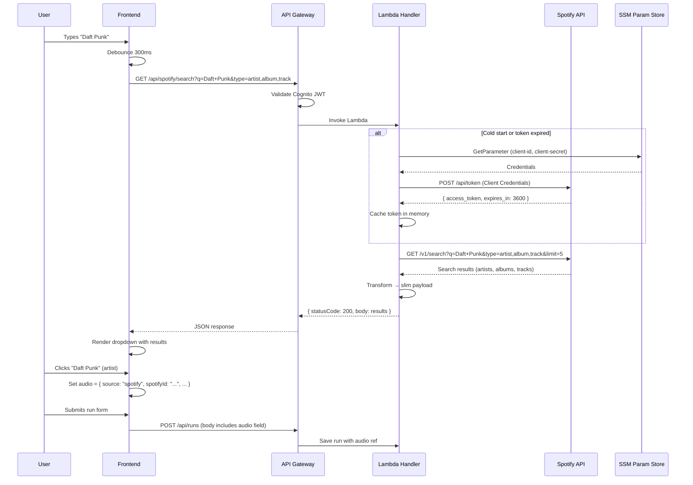

# Spotify Integration: Search & Autocomplete

## 1. Executive Summary

RunMapRepeat will integrate Spotify's public Search API to let users associate music (artist, album, or track) with their logged runs. When filling out the run form, users type an artist or track name and receive autocomplete suggestions powered by Spotify's search endpoint. The integration uses the **Client Credentials** auth flow (app-level token, no Spotify user login required). Selected items are stored as lightweight references alongside the run record and displayed with artwork and an "Open in Spotify" link. Manual text entry remains as a fallback.

## 2. Spotify Search API

### Endpoint

```
GET https://api.spotify.com/v1/search
```

### Query Parameters

| Parameter | Required | Description |
|-----------|----------|-------------|
| `q` | Yes | Search query string. Supports field filters: `artist:`, `album:`, `track:` |
| `type` | Yes | Comma-separated: `artist`, `album`, `track` |
| `limit` | No | Results per type. Default 5, max 10 (we'll use **5**) |
| `offset` | No | Pagination offset. Default 0, max 1000 |
| `market` | No | ISO 3166-1 alpha-2 country code for availability filtering |

### Response Structure (fields we use)

Each type returns a paginated wrapper (`{ href, limit, offset, total, next, items[] }`).

**Artist item:**
```json
{
  "id": "0TnOYISbd1XYRBk9myaseg",
  "name": "Pitbull",
  "images": [{ "url": "https://i.scdn.co/...", "height": 640, "width": 640 }],
  "external_urls": { "spotify": "https://open.spotify.com/artist/..." },
  "uri": "spotify:artist:0TnOYISbd1XYRBk9myaseg",
  "genres": ["dance pop", "latin hip hop"],
  "popularity": 82
}
```

**Album item:**
```json
{
  "id": "4aawyAB9vmqN3uQ7FjRGTy",
  "name": "Recovery",
  "album_type": "album",
  "release_date": "2010-06-18",
  "artists": [{ "id": "...", "name": "Eminem" }],
  "images": [{ "url": "https://i.scdn.co/...", "height": 640, "width": 640 }],
  "external_urls": { "spotify": "https://open.spotify.com/album/..." },
  "total_tracks": 17
}
```

**Track item:**
```json
{
  "id": "11dFghVXANMlKmJXsNCbNl",
  "name": "Cut To The Feeling",
  "artists": [{ "id": "...", "name": "Carly Rae Jepsen" }],
  "album": { "name": "Emotion Side B", "images": [...] },
  "duration_ms": 207905,
  "external_urls": { "spotify": "https://open.spotify.com/track/..." },
  "explicit": false
}
```

### Rate Limits

- Rolling **30-second window**; exact cap depends on app quota mode (Development vs Extended).
- Exceeding the limit returns **HTTP 429** with a `Retry-After` header (seconds).
- Best practices: debounce on the frontend, cache results in Lambda memory, use batch endpoints where available.

## 3. Authentication: Client Credentials Flow

This flow issues an **app-level** access token with no user context — sufficient for the Search endpoint, which is public.

### Token Request

```
POST https://accounts.spotify.com/api/token
Content-Type: application/x-www-form-urlencoded
Authorization: Basic <base64(client_id:client_secret)>

grant_type=client_credentials
```

### Token Response

```json
{
  "access_token": "NgCXRKc...MzYjw",
  "token_type": "bearer",
  "expires_in": 3600
}
```

### Token Caching Strategy

| Layer | Mechanism | TTL |
|-------|-----------|-----|
| Lambda warm instance | Module-level global (`_cached_token`, `_token_expiry`) | Until `expires_in - 60s` buffer |
| Cold start | Fresh token request on first invocation | ~1 hour |

Token is refreshed proactively when within 60 seconds of expiry, avoiding mid-request failures.

### Credential Storage

| Secret | Storage | Path |
|--------|---------|------|
| Spotify Client ID | SSM Parameter Store | `/runmaprepeat/spotify/client-id` |
| Spotify Client Secret | SSM Parameter Store (SecureString) | `/runmaprepeat/spotify/client-secret` |

Lambda IAM role gets `ssm:GetParameter` for these two paths only. Values are read once at cold start and cached in memory.

## 4. Backend

### New Lambda Handler: `handlers/spotify_search.py`

```
GET /api/spotify/search?q={query}&type={artist,album,track}
```

**Auth:** Cognito authorizer (same as all existing routes — user must be logged in).

**Handler flow:**

1. Validate query params (`q` required, `type` defaults to `artist,album,track`)
2. Obtain Spotify access token (cached or fresh)
3. Call `GET https://api.spotify.com/v1/search?q=...&type=...&limit=5`
4. Transform response → slim payload (see below)
5. Return `{ statusCode: 200, headers, body: JSON }`

**Transformed response shape:**

```json
{
  "artists": [
    {
      "spotifyId": "0TnOYISbd1XYRBk9myaseg",
      "name": "Pitbull",
      "imageUrl": "https://i.scdn.co/image/...",
      "spotifyUrl": "https://open.spotify.com/artist/...",
      "type": "artist"
    }
  ],
  "albums": [
    {
      "spotifyId": "4aawyAB9vmqN3uQ7FjRGTy",
      "name": "Recovery",
      "artistName": "Eminem",
      "imageUrl": "https://i.scdn.co/image/...",
      "spotifyUrl": "https://open.spotify.com/album/...",
      "type": "album"
    }
  ],
  "tracks": [
    {
      "spotifyId": "11dFghVXANMlKmJXsNCbNl",
      "name": "Cut To The Feeling",
      "artistName": "Carly Rae Jepsen",
      "albumName": "Emotion Side B",
      "imageUrl": "https://i.scdn.co/image/...",
      "spotifyUrl": "https://open.spotify.com/track/...",
      "type": "track"
    }
  ]
}
```

Image selection: pick the smallest image >= 64px wide (for the autocomplete thumbnail), falling back to the first image.

**Error handling:**
- Spotify 429 → return `{ statusCode: 429 }` with `Retry-After` forwarded
- Spotify 5xx / timeout → return `{ statusCode: 502, body: "Spotify unavailable" }`
- Missing `q` param → return `{ statusCode: 400 }`

### New Module: `data/spotify.py`

Encapsulates Spotify API interactions:

```python
def get_access_token() -> str: ...
def search(query: str, types: list[str], limit: int = 5) -> dict: ...
def _transform_results(raw: dict) -> dict: ...
def _pick_image(images: list[dict], min_width: int = 64) -> str | None: ...
```

### Response Caching (optional, phase 2)

For frequently repeated queries (e.g., "Taylor Swift"), cache transformed results in a module-level LRU dict keyed by `(query, types)` with a 5-minute TTL. Keeps Lambda memory usage bounded (max 100 entries).

## 5. Data Model

### Updated Run Record: `audio` Field

Currently runs have no structured audio field. We add an optional `audio` map attribute:

```json
{
  "audio": {
    "source": "spotify",
    "spotifyId": "0TnOYISbd1XYRBk9myaseg",
    "type": "artist",
    "name": "Pitbull",
    "artistName": "Pitbull",
    "imageUrl": "https://i.scdn.co/image/...",
    "spotifyUrl": "https://open.spotify.com/artist/..."
  }
}
```

**Manual entry fallback** (backwards compatible):

```json
{
  "audio": {
    "source": "manual",
    "name": "My Running Playlist",
    "artistName": "Various"
  }
}
```

**Backwards compatibility:** Existing runs without an `audio` field continue to work — the field is optional. The frontend checks `run.audio?.source` to determine rendering.

### TypeScript Type

```typescript
interface SpotifyRef {
  source: 'spotify';
  spotifyId: string;
  type: 'artist' | 'album' | 'track';
  name: string;
  artistName?: string;
  albumName?: string;
  imageUrl: string | null;
  spotifyUrl: string;
}

interface ManualAudioRef {
  source: 'manual';
  name: string;
  artistName?: string;
}

type AudioRef = SpotifyRef | ManualAudioRef;
```

## 6. Frontend UX

### Autocomplete Component: `SpotifySearch.tsx`

**Behavior:**

1. User focuses the audio input field and starts typing
2. After **300ms debounce**, frontend calls `GET /api/spotify/search?q={input}&type=artist,album,track`
3. Dropdown appears below input showing up to 15 results (5 per type), each with:
   - Thumbnail (64px artwork, rounded corners per Spotify guidelines: 4px)
   - Name (bold) + artist/album subtext
   - Type badge ("Artist" / "Album" / "Track")
   - Spotify icon indicator
4. User clicks a result → selection populates the form field
5. Selected item displays as a chip: artwork thumbnail + name + "x" to remove
6. Dropdown closes on selection, blur, or Escape key

**Keyboard navigation:** Arrow keys to move, Enter to select, Escape to close.

**Empty/error states:**
- No results: "No results found. You can type a name manually below."
- API error: Silent fallback to manual entry tab (no blocking error)
- Loading: Subtle spinner in the input field

### Run Detail Page

When a run has `audio.source === 'spotify'`:
- Show artwork (max 200px, 4px rounded corners)
- Display name and artist
- "Open in Spotify" button with Spotify icon (links to `spotifyUrl`)
- Spotify attribution logo (21px minimum width)

When `audio.source === 'manual'`:
- Show name and artist as plain text (no artwork)

### Manual Entry Tab

A tab or toggle below the search input: **"Search Spotify"** | **"Enter manually"**

Manual mode shows simple text inputs for name and artist. This ensures the feature works even if Spotify is down or the user prefers not to search.

## 7. Sequence Diagram



## 8. Implementation Steps

| # | Task | Effort | Details |
|---|------|--------|---------|
| 1 | Register Spotify app in Developer Dashboard | S | Get Client ID + Secret, store in SSM |
| 2 | `data/spotify.py` — token management + search wrapper | M | Client Credentials flow, token caching, search call, response transform |
| 3 | `handlers/spotify_search.py` — Lambda handler | S | Validate params, call data layer, return response |
| 4 | Tests for `data/spotify.py` and handler | M | Mock Spotify API responses, test token caching, error paths |
| 5 | API Gateway route (`GET /api/spotify/search`) | S | Add route + Cognito authorizer (infra change — needs review) |
| 6 | `AudioRef` TypeScript types | S | `SpotifyRef` and `ManualAudioRef` discriminated union |
| 7 | `SpotifySearch.tsx` autocomplete component | L | Debounced search, dropdown, keyboard nav, selection |
| 8 | Integrate into run form | M | Wire up audio field, show selected item chip |
| 9 | Run detail page — Spotify display | S | Artwork, "Open in Spotify" link, attribution |
| 10 | Frontend tests | M | Vitest unit tests for component, E2E for search flow |
| 11 | Manual entry fallback tab | S | Simple text inputs, tab toggle |
| 12 | Spotify branding compliance review | S | Logo placement, artwork display, link text |

**Effort key:** S = < 2 hours, M = 2–4 hours, L = 4–8 hours

**Total estimated effort:** ~4–5 days

## 9. Risks & Mitigations

| Risk | Impact | Mitigation |
|------|--------|------------|
| **Spotify rate limits** | Users see empty results | 300ms debounce, Lambda-level result caching, `Retry-After` handling |
| **Spotify API downtime** | Search unavailable | Manual entry tab as fallback; search errors degrade gracefully |
| **Artwork URL expiry** | Broken images on old runs | Spotify CDN URLs (`i.scdn.co`) are long-lived but not permanent. Accept this risk — broken images show a placeholder. Do not cache/proxy images (ToS). |
| **Token refresh race condition** | Concurrent Lambda invocations get 401 | Each invocation manages its own token; module-level cache is per-instance only |
| **Spotify API changes** | Breaking changes to response format | Pin to v1 API; transform layer isolates changes to `data/spotify.py` |
| **Cold start latency** | First search slow (~1s extra for SSM + token) | SSM values cached for Lambda lifetime; token cached for ~59 minutes |

## 10. Spotify Terms of Service Checklist

| Requirement | How we comply |
|-------------|--------------|
| **Attribution with Spotify logo** | Spotify icon displayed next to search results and on run detail page (min 21px) |
| **"Open in Spotify" link text** | Run detail page uses "Open in Spotify" button linking to `spotifyUrl` |
| **Artwork unmodified** | Displayed at original aspect ratio, no overlays, 4px rounded corners per guidelines |
| **No indefinite data storage** | We store only `spotifyId`, `name`, `imageUrl`, `spotifyUrl` as a reference. Full metadata is not cached beyond Lambda instance lifetime. |
| **No competing service adjacency** | No other music service integrations displayed alongside Spotify results |
| **Max 20 items per content set** | Search returns max 15 items (5 per type) |
| **No content used for ML/AI training** | Search results used only for display to the requesting user |
| **No user data accessed** | Client Credentials flow only — no user login, no listening history |
| **Current data displayed** | Search results are live from Spotify API; stored references link back to Spotify for current data |
